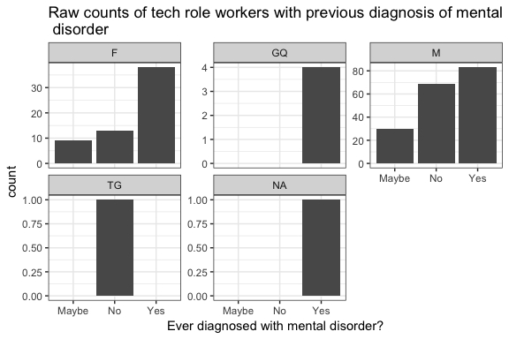

# Coarse Analysis of OSMI: Mental Health Tech 2016 Survey Results
Dale Richardson  
`r format(Sys.Date(), "%B %d, %Y")`  


## Description

[Open Sourcing Mental Illess (OSMI)](https://osmihelp.org) has an ongoing survey from 2016, which "aims to measure attitudes towards mental health in the tech workplace, and examine the frequency of mental health disorders among tech workers." The survey is conducted online at the OSMI website and the OSMI team intends to use these data to help drive awareness and improve conditions for individuals with mental illness in the IT workplace. 

It should be noted that the survey may be prone to certain biases. The sample of respondents ($n = 1433$) was not obtained through any random sampling approach. Furthermore, as the survey is conducted online, voluntary response bias should also be considered - i.e., self-selected respondents may have a particular opinions/experiences that cause overrepresentation in the data. 

Lastly, as this is an observational study with potential sampling biases present, it is important to remember that causality can not be inferred. The results of the survey may not be generalizable to the entire population of Tech/IT workers due to the lack of random sampling. 

Bearing the above limitations in mind and being cautious with our interpretations, we can still use these data to glean some insight into the state of mental health in the tech workplace.

## Coarse Highlights
1. Female and Gender Queer respondents suffer more from mental health disorders than Males
2. Being self-employed does not affect incidence mental health disorders
3. Larger companies formally talk about mental health more often but don't take mental health issues seriously
4. Designers suffer most from mental health disorders whereas Front-end Developers suffer least

Please see the Final Remarks and  at the end of the document for more detail on these findings (as well as the actual exploratory analyses!)

GitHub [repo](https://github.com/dnrichardson/osmi) of all relevant files.

## Load data

Survey results were downloaded from [data.world](https://data.world/kittybot/osmi-mental-health-tech-2016) in `.csv` format. The file was downloaded on March 25, 2017.


```r
# load packages
library(dplyr)
library(stringr)
library(ggplot2)
library(plotly)
library(wesanderson)
set.seed(1000)

# load dataset
mental.health <- read.csv("~/Dropbox/Data4Democracy/mental_health_in_tech/mental-heath-in-tech-2016_20161114.csv", header = TRUE, stringsAsFactors = TRUE)

# check structure
#str(mental.health)
```

## Clean data

The first major issue that needs to be fixed is the variable names. The variable names in the `.csv` file are the actual survey questions themselves, which are too long for easy handling. I will create new variable names based on my own abbreviations of the survey's questions. In time, I may add a correpondence table to cross-reference the original variable names to my abbreviated ones. 


```r
# create new variable names
new.names <- c("self.employed", "num.employees", "tech.company", "tech.role", "mental.health.coverage", "mental.health.options", "mental.health.formally.discussed", "mental.health.resources", "anonymity.protected", "medical.leave", "mental.health.negative", "physical.health.negative", "mental.health.comfort.coworker", "mental.health.comfort.supervisor", "mental.health.taken.seriously", "coworker.negative.consequences", "private.med.coverage", "resources", "reveal.diagnosis.clients.or.business", "revealed.negative.consequences.CB", "reveal.diagnosis.coworkers", "revealed.negative.consequences.CW", "productivity.effected", "percentage", "previous.employer", "prevemp.mental.health.coverage", "prevemp.mental.health.options", "prevemp.mental.health.formally.discussed", "prevemp.mental.health.resources", "prevemp.anonymity.protected", "prevemp.mental.health.negative",
               "prevemp.physical.health.negative", "prevemp.mental.health.coworker", "prevemp.mental.health.comfort.supervisor", "prevemp.mental.health.taken.seriously", "prevemp.coworker.negative.consequences", "mention.phsyical.issue.interview", "why.whynot.physical", "mention.mental.health.interview", "why.whynot.mental", "career.hurt", "viewed.negatively.by.coworkers", "share.with.family", "observed.poor.handling", "observations.lead.less.likely.to.reveal", "family.history", "ever.had.mental.disorder", "currently.have.mental.disorder", "if.yes.what", "if.maybe.what", "medical.prof.diagnosis", "what.conditions", "sought.prof.treatment", "treatment.affects.work", "no.treatment.affects.work", "age", "gender", "country.live", "US.state", "country.work", "state.work", "work.position", "remotely"  )

# change names
colnames(mental.health) <- new.names
# check
#str(mental.health)

# what does gender variable look like?
head(table(mental.health$gender))
```

```
## 
##                  Female        AFAB     Agender Androgynous    Bigender 
##           1           1           1           2           1           1
```

```r
tail(table(mental.health$gender))
```

```
## 
##       Sex is male Transgender woman Transitioned, M2F           Unicorn 
##                 1                 1                 1                 1 
##             woman             Woman 
##                 4                 3
```

```r
# ok, we have some issues with gender that need to be cleaned up - see next section below

# convert some factor variables to character
mental.health$why.whynot.physical <- as.character(mental.health$why.whynot.physical)
mental.health$why.whynot.mental <- as.character(mental.health$why.whynot.mental)
mental.health$gender <- as.character(mental.health$gender)
mental.health$work.position <- as.character(mental.health$work.position)

# convert boolean to factor
mental.health$self.employed <- as.factor(mental.health$self.employed)
levels(mental.health$self.employed) <- c("No", "Yes")
mental.health$tech.role <- as.factor(mental.health$tech.role)
levels(mental.health$tech.role) <- c("No", "Yes")
```

### Cleaning up the gender variable
The open-ended, free-form text response to gender on the survey will necessitate some data cleaning. There are several non-standard responses, i.e. *"Unicorn"* and *"I'm a man why didn't you make this a drop down question. You should of asked sex? And I would of answered yes please. Seriously how much text can this take?"* Other types of responses included some variants of being Gender Queer, non-binary, etc. 

If someone responded as transgender, I have coded their gender as `TG`. If someone responded with a variation of being Gender Queer, i.e. "gender fluid", "human", "androgenous", I have coded their gender as `GQ`. Otherwise, gender has been encoded as either `M` or `F`, unless the field was left blank (`NA`) or the survey participant refused to answer (`Refused`). 


```r
# let's try to standardize responses
mental.health[mental.health$gender == "Male", "gender"] <- "M"
mental.health[mental.health$gender == "male", "gender"] <- "M"
mental.health[mental.health$gender == "MALE", "gender"] <- "M"
mental.health[mental.health$gender == "Man", "gender"] <- "M"
mental.health[mental.health$gender == "man", "gender"] <- "M"
mental.health[mental.health$gender == "m", "gender"] <- "M"
mental.health[mental.health$gender == "man ", "gender"] <- "M"
mental.health[mental.health$gender == "Dude", "gender"] <- "M"
mental.health[mental.health$gender == "mail", "gender"] <- "M"
mental.health[mental.health$gender == "M|", "gender"] <- "M"
mental.health[mental.health$gender == "Cis male", "gender"] <- "M"
mental.health[mental.health$gender == "Male (cis)", "gender"] <- "M"
mental.health[mental.health$gender == "Cis Male", "gender"] <- "M"
mental.health[mental.health$gender == "cis male", "gender"] <- "M"
mental.health[mental.health$gender == "cisdude", "gender"] <- "M"
mental.health[mental.health$gender == "cis man", "gender"] <- "M"
mental.health[mental.health$gender == "Male.", "gender"] <- "M"
mental.health[mental.health$gender == "Male ", "gender"] <- "M"
mental.health[mental.health$gender == "male ", "gender"] <- "M"
mental.health[mental.health$gender == "Malr", "gender"] <- "M"
mental.health[841,"gender"] <- "M"

mental.health[mental.health$gender == "Female", "gender"] <- "F"
mental.health[mental.health$gender == "Female ", "gender"] <- "F"
mental.health[mental.health$gender == " Female", "gender"] <- "F"
mental.health[mental.health$gender == "female", "gender"] <- "F"
mental.health[mental.health$gender == "female ", "gender"] <- "F"
mental.health[mental.health$gender == "Woman", "gender"] <- "F"
mental.health[mental.health$gender == "woman", "gender"] <- "F"
mental.health[mental.health$gender == "f", "gender"] <- "F"
mental.health[mental.health$gender == "Cis female", "gender"] <- "F"
mental.health[mental.health$gender == "Cis female ", "gender"] <- "F"
mental.health[mental.health$gender == "Cisgender Female", "gender"] <- "F"
mental.health[mental.health$gender == "Cis-woman", "gender"] <- "F"
mental.health[mental.health$gender == "fem", "gender"] <- "F"
mental.health[1091, "gender"] <- "F"
mental.health[17, "gender"] <- "F"

# gender queer (GQ)
mental.health[mental.health$gender == "Agender", "gender"] <- "GQ"
mental.health[mental.health$gender == "Androgynous", "gender"] <- "GQ"
mental.health[mental.health$gender == "Bigender", "gender"] <- "GQ"
mental.health[mental.health$gender == "Female or Multi-Gender Femme", "gender"] <- "GQ"
mental.health[mental.health$gender == "female-bodied; no feelings about gender", "gender"] <- "GQ"
mental.health[mental.health$gender == "Fluid", "gender"] <- "GQ"
mental.health[mental.health$gender == "fm", "gender"] <- "GQ"
mental.health[mental.health$gender == "GenderFluid", "gender"] <- "GQ"
mental.health[mental.health$gender == "GenderFluid (born female)", "gender"] <- "GQ"
mental.health[mental.health$gender == "Genderflux demi-girl", "gender"] <- "GQ"
mental.health[mental.health$gender == "genderqueer", "gender"] <- "GQ"
mental.health[mental.health$gender == "Genderqueer", "gender"] <- "GQ"
mental.health[mental.health$gender == "fm", "gender"] <- "GQ"
mental.health[mental.health$gender == "genderqueer woman", "gender"] <- "GQ"
mental.health[mental.health$gender == "human", "gender"] <- "GQ"
mental.health[mental.health$gender == "Human", "gender"] <- "GQ"
mental.health[mental.health$gender == "Unicorn", "gender"] <- "GQ"
mental.health[mental.health$gender == "Male/genderqueer", "gender"] <- "GQ"
mental.health[mental.health$gender == "nb masculine", "gender"] <- "GQ"
mental.health[mental.health$gender == "non-binary", "gender"] <- "GQ"
mental.health[mental.health$gender == "Nonbinary", "gender"] <- "GQ"
mental.health[mental.health$gender == "AFAB", "gender"] <- "GQ"

# transgender (TG)
mental.health[mental.health$gender == "Male (trans, FtM)", "gender"] <- "TG"
mental.health[mental.health$gender == "Transgender woman", "gender"] <- "TG"

# see what's left
index <- which(mental.health$gender != "M" & mental.health$gender != "F" & mental.health$gender != "GQ" & mental.health$gender != "TG")

mental.health[index, "gender"]
```

```
##  [1] "Female assigned at birth " "Transitioned, M2F"        
##  [3] "Genderfluid (born female)" "Other/Transfeminine"      
##  [5] "female/woman"              "male 9:1 female, roughly" 
##  [7] "N/A"                       "Other"                    
##  [9] "Sex is male"               "none of your business"    
## [11] "Genderfluid"               "N/A"                      
## [13] "Enby"                      "mtf"                      
## [15] "Queer"                     ""
```

```r
# create vector of final gender values to fill in based on index
last.genders <- c("F", "TG", "GQ", "GQ", "F", "GQ", "GQ", "GQ", "M", "Refused", "GQ", "GQ", "GQ", "TG", "GQ", NA)

# fill in remaining values
mental.health[index, "gender"] <- last.genders

# check gender
table(mental.health$gender)
```

```
## 
##       F      GQ       M Refused      TG 
##     337      33    1057       1       4
```

```r
# convert gender back to factor
mental.health$gender <- as.factor(mental.health$gender)
```
## Exploratory Data Analysis

### How many respondents with a tech role have ever been diagnosed with a mental disorder?

To answer this question, I will restrict myself to only those respondents who have provided an answer to the question, *Is your primary role within your company related to tech/IT?*


```r
# exclude NA responses in the tech.role variable
tekkies <- mental.health %>% filter(!is.na(tech.role)) 

#how many respondents total?
nrow(tekkies)
```

```
## [1] 263
```

```r
# how many tech workers?
nrow(tekkies[tekkies$tech.role == "Yes", ])
```

```
## [1] 248
```

```r
# get only tech workers
tekkies <- tekkies[tekkies$tech.role == "Yes", ]

# what is the gender breakdown?
table(tekkies$gender)
```

```
## 
##       F      GQ       M Refused      TG 
##      60       4     182       0       1
```

```r
#group by variables of interest
tekkies.grouped <- tekkies %>% group_by(gender, ever.had.mental.disorder)

# plot counts
ggplot(tekkies, aes(ever.had.mental.disorder)) + geom_bar() + facet_wrap(~gender, scales = "free_y") +
        ggtitle("Raw counts of tech role workers with previous diagnosis of mental\n disorder") +
        xlab("Ever diagnosed with mental disorder?") +
        theme_bw()
```

<!-- -->

```r
## create summary of counts and relative frequencies for each class
forPlotting <- tekkies.grouped %>%
        summarise(n = n()) %>%
        mutate(freq = n / sum(n))

# show frequencies
forPlotting
```

```
## Source: local data frame [9 x 4]
## Groups: gender [5]
## 
##   gender ever.had.mental.disorder     n      freq
##   <fctr>                   <fctr> <int>     <dbl>
## 1      F                    Maybe     9 0.1500000
## 2      F                       No    13 0.2166667
## 3      F                      Yes    38 0.6333333
## 4     GQ                      Yes     4 1.0000000
## 5      M                    Maybe    30 0.1648352
## 6      M                       No    69 0.3791209
## 7      M                      Yes    83 0.4560440
## 8     TG                       No     1 1.0000000
## 9     NA                      Yes     1 1.0000000
```

```r
# remove the one TG, one NA and 4 GQ respondents
tekkies.grouped <- tekkies %>% filter(gender != "TG", gender != "NA", gender != "GQ") %>% group_by(gender, ever.had.mental.disorder)

## create updated summary of counts and relative frequencies for each class
forPlotting <- tekkies.grouped %>%
        summarise(n = n()) %>%
        mutate(freq = n / sum(n))

# plot relative frequencies with a stacked bar plot 
gg <- ggplot(forPlotting, aes(x = gender, y = freq, fill = ever.had.mental.disorder)) + 
        geom_bar(stat = "identity") +
         ggtitle("Tech role workers with previous diagnosis of mental disorder") +
         xlab("Gender") +
         ylab("Relative frequency") +
         guides(fill=guide_legend(title=NULL)) +
         scale_fill_manual(values=wes_palette(n=3, name="GrandBudapest2")) +
         theme_bw()

ggplotly(gg)
```

<!--html_preserve--><div id="htmlwidget-53c21db08411bd953741" style="width:576px;height:384px;" class="plotly html-widget"></div>
<script type="application/json" data-for="htmlwidget-53c21db08411bd953741">{"x":{"data":[{"x":[1,2],"y":[0.633333333333333,0.456043956043956],"text":["gender: F<br>freq: 0.6333333<br>ever.had.mental.disorder: Yes","gender: M<br>freq: 0.4560440<br>ever.had.mental.disorder: Yes"],"type":"bar","marker":{"autocolorscale":false,"color":"rgba(216,164,153,1)","line":{"width":1.88976377952756,"color":"transparent"}},"name":"Yes","legendgroup":"Yes","showlegend":true,"xaxis":"x","yaxis":"y","hoverinfo":"text","frame":null},{"x":[1,2],"y":[0.216666666666667,0.379120879120879],"text":["gender: F<br>freq: 0.2166667<br>ever.had.mental.disorder: No","gender: M<br>freq: 0.3791209<br>ever.had.mental.disorder: No"],"type":"bar","marker":{"autocolorscale":false,"color":"rgba(198,205,247,1)","line":{"width":1.88976377952756,"color":"transparent"}},"name":"No","legendgroup":"No","showlegend":true,"xaxis":"x","yaxis":"y","hoverinfo":"text","frame":null},{"x":[1,2],"y":[0.15,0.164835164835165],"text":["gender: F<br>freq: 0.1500000<br>ever.had.mental.disorder: Maybe","gender: M<br>freq: 0.1648352<br>ever.had.mental.disorder: Maybe"],"type":"bar","marker":{"autocolorscale":false,"color":"rgba(230,160,196,1)","line":{"width":1.88976377952756,"color":"transparent"}},"name":"Maybe","legendgroup":"Maybe","showlegend":true,"xaxis":"x","yaxis":"y","hoverinfo":"text","frame":null}],"layout":{"margin":{"t":44.4931506849315,"r":7.30593607305936,"b":40.9132420091324,"l":48.9497716894977},"plot_bgcolor":"rgba(255,255,255,1)","paper_bgcolor":"rgba(255,255,255,1)","font":{"color":"rgba(0,0,0,1)","family":"","size":14.6118721461187},"title":"Tech role workers with previous diagnosis of mental disorder","titlefont":{"color":"rgba(0,0,0,1)","family":"","size":17.5342465753425},"xaxis":{"domain":[0,1],"type":"linear","autorange":false,"tickmode":"array","range":[0.4,2.6],"ticktext":["F","M"],"tickvals":[1,2],"ticks":"outside","tickcolor":"rgba(51,51,51,1)","ticklen":3.65296803652968,"tickwidth":0.66417600664176,"showticklabels":true,"tickfont":{"color":"rgba(77,77,77,1)","family":"","size":11.689497716895},"tickangle":-0,"showline":false,"linecolor":null,"linewidth":0,"showgrid":true,"gridcolor":"rgba(235,235,235,1)","gridwidth":0.66417600664176,"zeroline":false,"anchor":"y","title":"Gender","titlefont":{"color":"rgba(0,0,0,1)","family":"","size":14.6118721461187},"hoverformat":".2f"},"yaxis":{"domain":[0,1],"type":"linear","autorange":false,"tickmode":"array","range":[-0.05,1.05],"ticktext":["0.00","0.25","0.50","0.75","1.00"],"tickvals":[0,0.25,0.5,0.75,1],"ticks":"outside","tickcolor":"rgba(51,51,51,1)","ticklen":3.65296803652968,"tickwidth":0.66417600664176,"showticklabels":true,"tickfont":{"color":"rgba(77,77,77,1)","family":"","size":11.689497716895},"tickangle":-0,"showline":false,"linecolor":null,"linewidth":0,"showgrid":true,"gridcolor":"rgba(235,235,235,1)","gridwidth":0.66417600664176,"zeroline":false,"anchor":"x","title":"Relative frequency","titlefont":{"color":"rgba(0,0,0,1)","family":"","size":14.6118721461187},"hoverformat":".2f"},"shapes":[{"type":"rect","fillcolor":"transparent","line":{"color":"rgba(51,51,51,1)","width":0.66417600664176,"linetype":"solid"},"yref":"paper","xref":"paper","x0":0,"x1":1,"y0":0,"y1":1}],"showlegend":true,"legend":{"bgcolor":"rgba(255,255,255,1)","bordercolor":"transparent","borderwidth":1.88976377952756,"font":{"color":"rgba(0,0,0,1)","family":"","size":11.689497716895},"y":1,"traceorder":"reversed"},"barmode":"stack","hovermode":"closest","dragmode":"zoom"},"config":{"doubleClick":"reset","modeBarButtonsToAdd":[{"name":"Collaborate","icon":{"width":1000,"ascent":500,"descent":-50,"path":"M487 375c7-10 9-23 5-36l-79-259c-3-12-11-23-22-31-11-8-22-12-35-12l-263 0c-15 0-29 5-43 15-13 10-23 23-28 37-5 13-5 25-1 37 0 0 0 3 1 7 1 5 1 8 1 11 0 2 0 4-1 6 0 3-1 5-1 6 1 2 2 4 3 6 1 2 2 4 4 6 2 3 4 5 5 7 5 7 9 16 13 26 4 10 7 19 9 26 0 2 0 5 0 9-1 4-1 6 0 8 0 2 2 5 4 8 3 3 5 5 5 7 4 6 8 15 12 26 4 11 7 19 7 26 1 1 0 4 0 9-1 4-1 7 0 8 1 2 3 5 6 8 4 4 6 6 6 7 4 5 8 13 13 24 4 11 7 20 7 28 1 1 0 4 0 7-1 3-1 6-1 7 0 2 1 4 3 6 1 1 3 4 5 6 2 3 3 5 5 6 1 2 3 5 4 9 2 3 3 7 5 10 1 3 2 6 4 10 2 4 4 7 6 9 2 3 4 5 7 7 3 2 7 3 11 3 3 0 8 0 13-1l0-1c7 2 12 2 14 2l218 0c14 0 25-5 32-16 8-10 10-23 6-37l-79-259c-7-22-13-37-20-43-7-7-19-10-37-10l-248 0c-5 0-9-2-11-5-2-3-2-7 0-12 4-13 18-20 41-20l264 0c5 0 10 2 16 5 5 3 8 6 10 11l85 282c2 5 2 10 2 17 7-3 13-7 17-13z m-304 0c-1-3-1-5 0-7 1-1 3-2 6-2l174 0c2 0 4 1 7 2 2 2 4 4 5 7l6 18c0 3 0 5-1 7-1 1-3 2-6 2l-173 0c-3 0-5-1-8-2-2-2-4-4-4-7z m-24-73c-1-3-1-5 0-7 2-2 3-2 6-2l174 0c2 0 5 0 7 2 3 2 4 4 5 7l6 18c1 2 0 5-1 6-1 2-3 3-5 3l-174 0c-3 0-5-1-7-3-3-1-4-4-5-6z"},"click":"function(gd) { \n        // is this being viewed in RStudio?\n        if (location.search == '?viewer_pane=1') {\n          alert('To learn about plotly for collaboration, visit:\\n https://cpsievert.github.io/plotly_book/plot-ly-for-collaboration.html');\n        } else {\n          window.open('https://cpsievert.github.io/plotly_book/plot-ly-for-collaboration.html', '_blank');\n        }\n      }"}],"modeBarButtonsToRemove":["sendDataToCloud"]},"source":"A","attrs":{"1796a53152d9c":{"x":{},"y":{},"fill":{},"type":"bar"}},"cur_data":"1796a53152d9c","visdat":{"1796a53152d9c":["function (y) ","x"]},"highlight":{"on":"plotly_selected","off":"plotly_relayout","persistent":false,"dynamic":false,"selectize":false,"opacityDim":0.2,"showInLegend":false,"ctGroups":[]},"base_url":"https://plot.ly"},"evals":["config.modeBarButtonsToAdd.0.click"],"jsHooks":{"render":[{"code":"function(el, x) { var ctConfig = crosstalk.var('plotlyCrosstalkOpts').set({\"on\":\"plotly_selected\",\"off\":\"plotly_relayout\",\"persistent\":false,\"dynamic\":false,\"color\":{},\"selectize\":false,\"defaultValues\":{},\"opacityDim\":0.2,\"hoverinfo\":{},\"showInLegend\":false}); }","data":null}]}}</script><!--/html_preserve-->

The first thing to note is that many of the survey respondents did not provide an answer to the question, *"Is your primary role within your company related to tech/IT?"*. In fact, out of `1433` total respondents, only `263` provided a response, while `1170` respondents left this field empty. As I found this to be out of the ordinary, I checked the survey online. It appears that this question is no longer present in the current form the survey, which would explain the large number of missing data.

Perhaps unsurprisingly, there are roughly three times more male (`182`) than female (`60`) respondents in this restricted dataset (tech role only). However, there is a higher proportion of female respondents who have had a diagnosis of a mental health disorder (roughly `63%` vs `46%`, respectively). The reasons for this are not clear, but it could be that men are less likely to seek out professional medical assistance as it pertains to mental health issues and therefore would have a lower frequency of medically diagnosed mental health disorders. 

Lastly, of the four respondents who identified as being `GQ` or Gender Queer, all had been diagnosed with a mental health disorder in the past, while the single `TG` (transgender) respondent had no past diagnosis of a mental health disorder.

### How many respondents with a tech role currently have a mental disorder?
To answer this question, I will use the same subset of data that I used above.


```r
# quick count
table(tekkies$currently.have.mental.disorder)
```

```
## 
## Maybe    No   Yes 
##    56    95    97
```

```r
# group by variables of interest
tekkies.grouped <- tekkies %>% group_by(gender, currently.have.mental.disorder)

# create summary of counts and relative frequencies for each class
forPlotting <- tekkies.grouped %>%
        summarise(n = n()) %>%
        mutate(freq = n / sum(n))

# show updated frequencies
forPlotting
```

```
## Source: local data frame [10 x 4]
## Groups: gender [5]
## 
##    gender currently.have.mental.disorder     n      freq
##    <fctr>                         <fctr> <int>     <dbl>
## 1       F                          Maybe    10 0.1666667
## 2       F                             No    19 0.3166667
## 3       F                            Yes    31 0.5166667
## 4      GQ                          Maybe     1 0.2500000
## 5      GQ                            Yes     3 0.7500000
## 6       M                          Maybe    45 0.2472527
## 7       M                             No    76 0.4175824
## 8       M                            Yes    61 0.3351648
## 9      TG                            Yes     1 1.0000000
## 10     NA                            Yes     1 1.0000000
```

```r
# remove the one TG, one NA and 4 GQ respondents
tekkies.grouped <- tekkies %>% filter(gender != "TG", gender != "NA", gender != "GQ") %>% group_by(gender, currently.have.mental.disorder)

## create updated summary of counts and relative frequencies for each class
forPlotting <- tekkies.grouped %>%
        summarise(n = n()) %>%
        mutate(freq = n / sum(n))

# plot relative frequencies with a stacked bar plot filled by current diagnosis
gg <- ggplot(forPlotting, aes(x = gender, y = freq, fill = currently.have.mental.disorder)) + 
        geom_bar(stat = "identity") +
         ggtitle("Female tech workers have higher incidence of mental health disorders") +
         xlab("Gender") +
         ylab("Relative frequency") +
         guides(fill=guide_legend(title=NULL)) +
         scale_fill_manual(values=wes_palette(n=3, name="GrandBudapest2")) +
         theme_bw()

ggplotly(gg)
```

<!--html_preserve--><div id="htmlwidget-59c151ddc3127ea21595" style="width:576px;height:384px;" class="plotly html-widget"></div>
<script type="application/json" data-for="htmlwidget-59c151ddc3127ea21595">{"x":{"data":[{"x":[1,2],"y":[0.516666666666667,0.335164835164835],"text":["gender: F<br>freq: 0.5166667<br>currently.have.mental.disorder: Yes","gender: M<br>freq: 0.3351648<br>currently.have.mental.disorder: Yes"],"type":"bar","marker":{"autocolorscale":false,"color":"rgba(216,164,153,1)","line":{"width":1.88976377952756,"color":"transparent"}},"name":"Yes","legendgroup":"Yes","showlegend":true,"xaxis":"x","yaxis":"y","hoverinfo":"text","frame":null},{"x":[1,2],"y":[0.316666666666667,0.417582417582418],"text":["gender: F<br>freq: 0.3166667<br>currently.have.mental.disorder: No","gender: M<br>freq: 0.4175824<br>currently.have.mental.disorder: No"],"type":"bar","marker":{"autocolorscale":false,"color":"rgba(198,205,247,1)","line":{"width":1.88976377952756,"color":"transparent"}},"name":"No","legendgroup":"No","showlegend":true,"xaxis":"x","yaxis":"y","hoverinfo":"text","frame":null},{"x":[1,2],"y":[0.166666666666667,0.247252747252747],"text":["gender: F<br>freq: 0.1666667<br>currently.have.mental.disorder: Maybe","gender: M<br>freq: 0.2472527<br>currently.have.mental.disorder: Maybe"],"type":"bar","marker":{"autocolorscale":false,"color":"rgba(230,160,196,1)","line":{"width":1.88976377952756,"color":"transparent"}},"name":"Maybe","legendgroup":"Maybe","showlegend":true,"xaxis":"x","yaxis":"y","hoverinfo":"text","frame":null}],"layout":{"margin":{"t":44.4931506849315,"r":7.30593607305936,"b":40.9132420091324,"l":48.9497716894977},"plot_bgcolor":"rgba(255,255,255,1)","paper_bgcolor":"rgba(255,255,255,1)","font":{"color":"rgba(0,0,0,1)","family":"","size":14.6118721461187},"title":"Female tech workers have higher incidence of mental health disorders","titlefont":{"color":"rgba(0,0,0,1)","family":"","size":17.5342465753425},"xaxis":{"domain":[0,1],"type":"linear","autorange":false,"tickmode":"array","range":[0.4,2.6],"ticktext":["F","M"],"tickvals":[1,2],"ticks":"outside","tickcolor":"rgba(51,51,51,1)","ticklen":3.65296803652968,"tickwidth":0.66417600664176,"showticklabels":true,"tickfont":{"color":"rgba(77,77,77,1)","family":"","size":11.689497716895},"tickangle":-0,"showline":false,"linecolor":null,"linewidth":0,"showgrid":true,"gridcolor":"rgba(235,235,235,1)","gridwidth":0.66417600664176,"zeroline":false,"anchor":"y","title":"Gender","titlefont":{"color":"rgba(0,0,0,1)","family":"","size":14.6118721461187},"hoverformat":".2f"},"yaxis":{"domain":[0,1],"type":"linear","autorange":false,"tickmode":"array","range":[-0.05,1.05],"ticktext":["0.00","0.25","0.50","0.75","1.00"],"tickvals":[0,0.25,0.5,0.75,1],"ticks":"outside","tickcolor":"rgba(51,51,51,1)","ticklen":3.65296803652968,"tickwidth":0.66417600664176,"showticklabels":true,"tickfont":{"color":"rgba(77,77,77,1)","family":"","size":11.689497716895},"tickangle":-0,"showline":false,"linecolor":null,"linewidth":0,"showgrid":true,"gridcolor":"rgba(235,235,235,1)","gridwidth":0.66417600664176,"zeroline":false,"anchor":"x","title":"Relative frequency","titlefont":{"color":"rgba(0,0,0,1)","family":"","size":14.6118721461187},"hoverformat":".2f"},"shapes":[{"type":"rect","fillcolor":"transparent","line":{"color":"rgba(51,51,51,1)","width":0.66417600664176,"linetype":"solid"},"yref":"paper","xref":"paper","x0":0,"x1":1,"y0":0,"y1":1}],"showlegend":true,"legend":{"bgcolor":"rgba(255,255,255,1)","bordercolor":"transparent","borderwidth":1.88976377952756,"font":{"color":"rgba(0,0,0,1)","family":"","size":11.689497716895},"y":1,"traceorder":"reversed"},"barmode":"stack","hovermode":"closest","dragmode":"zoom"},"config":{"doubleClick":"reset","modeBarButtonsToAdd":[{"name":"Collaborate","icon":{"width":1000,"ascent":500,"descent":-50,"path":"M487 375c7-10 9-23 5-36l-79-259c-3-12-11-23-22-31-11-8-22-12-35-12l-263 0c-15 0-29 5-43 15-13 10-23 23-28 37-5 13-5 25-1 37 0 0 0 3 1 7 1 5 1 8 1 11 0 2 0 4-1 6 0 3-1 5-1 6 1 2 2 4 3 6 1 2 2 4 4 6 2 3 4 5 5 7 5 7 9 16 13 26 4 10 7 19 9 26 0 2 0 5 0 9-1 4-1 6 0 8 0 2 2 5 4 8 3 3 5 5 5 7 4 6 8 15 12 26 4 11 7 19 7 26 1 1 0 4 0 9-1 4-1 7 0 8 1 2 3 5 6 8 4 4 6 6 6 7 4 5 8 13 13 24 4 11 7 20 7 28 1 1 0 4 0 7-1 3-1 6-1 7 0 2 1 4 3 6 1 1 3 4 5 6 2 3 3 5 5 6 1 2 3 5 4 9 2 3 3 7 5 10 1 3 2 6 4 10 2 4 4 7 6 9 2 3 4 5 7 7 3 2 7 3 11 3 3 0 8 0 13-1l0-1c7 2 12 2 14 2l218 0c14 0 25-5 32-16 8-10 10-23 6-37l-79-259c-7-22-13-37-20-43-7-7-19-10-37-10l-248 0c-5 0-9-2-11-5-2-3-2-7 0-12 4-13 18-20 41-20l264 0c5 0 10 2 16 5 5 3 8 6 10 11l85 282c2 5 2 10 2 17 7-3 13-7 17-13z m-304 0c-1-3-1-5 0-7 1-1 3-2 6-2l174 0c2 0 4 1 7 2 2 2 4 4 5 7l6 18c0 3 0 5-1 7-1 1-3 2-6 2l-173 0c-3 0-5-1-8-2-2-2-4-4-4-7z m-24-73c-1-3-1-5 0-7 2-2 3-2 6-2l174 0c2 0 5 0 7 2 3 2 4 4 5 7l6 18c1 2 0 5-1 6-1 2-3 3-5 3l-174 0c-3 0-5-1-7-3-3-1-4-4-5-6z"},"click":"function(gd) { \n        // is this being viewed in RStudio?\n        if (location.search == '?viewer_pane=1') {\n          alert('To learn about plotly for collaboration, visit:\\n https://cpsievert.github.io/plotly_book/plot-ly-for-collaboration.html');\n        } else {\n          window.open('https://cpsievert.github.io/plotly_book/plot-ly-for-collaboration.html', '_blank');\n        }\n      }"}],"modeBarButtonsToRemove":["sendDataToCloud"]},"source":"A","attrs":{"1796a253b8eda":{"x":{},"y":{},"fill":{},"type":"bar"}},"cur_data":"1796a253b8eda","visdat":{"1796a253b8eda":["function (y) ","x"]},"highlight":{"on":"plotly_selected","off":"plotly_relayout","persistent":false,"dynamic":false,"selectize":false,"opacityDim":0.2,"showInLegend":false,"ctGroups":[]},"base_url":"https://plot.ly"},"evals":["config.modeBarButtonsToAdd.0.click"],"jsHooks":{"render":[{"code":"function(el, x) { var ctConfig = crosstalk.var('plotlyCrosstalkOpts').set({\"on\":\"plotly_selected\",\"off\":\"plotly_relayout\",\"persistent\":false,\"dynamic\":false,\"color\":{},\"selectize\":false,\"defaultValues\":{},\"opacityDim\":0.2,\"hoverinfo\":{},\"showInLegend\":false}); }","data":null}]}}</script><!--/html_preserve-->

As was the case with having previous history of mental disorder, we see similar trends in those who currently have a mental health disorder. Roughly `52%` of female respondents indicated they are currently suffering from a mental health disorder, in contrast to only `34%` of male respondents. However, there are more male respondents who indicated that they "maybe" have a mental disorder than female respondents (`25%` versus `17%`, respectively).

### How many of the total survey respondents *currently* suffer from a mental health disorder?

As it appears that the majority of survey respondents did not receive the question, *"Is your primary role within your company related to tech/IT?"*, I will now focus the remainder of the analyses using the full set of respondents. 


```r
# quick table count
table(mental.health$currently.have.mental.disorder)
```

```
## 
## Maybe    No   Yes 
##   327   531   575
```

```r
# group the data
all <- mental.health %>%  group_by(gender, currently.have.mental.disorder)

# calculate frequencies
forPlotting <- all %>%
        summarise(n = n()) %>%
        mutate(freq = n / sum(n))

# show freqs
forPlotting
```

```
## Source: local data frame [12 x 4]
## Groups: gender [6]
## 
##     gender currently.have.mental.disorder     n       freq
##     <fctr>                         <fctr> <int>      <dbl>
## 1        F                          Maybe    57 0.16913947
## 2        F                             No    99 0.29376855
## 3        F                            Yes   181 0.53709199
## 4       GQ                          Maybe     9 0.27272727
## 5       GQ                             No     2 0.06060606
## 6       GQ                            Yes    22 0.66666667
## 7        M                          Maybe   260 0.24597919
## 8        M                             No   430 0.40681173
## 9        M                            Yes   367 0.34720908
## 10 Refused                          Maybe     1 1.00000000
## 11      TG                            Yes     4 1.00000000
## 12      NA                            Yes     1 1.00000000
```

```r
# remove Refused and NA respondents and regroup data
all <- mental.health %>% filter(gender != "NA", gender != "Refused") %>% 
        group_by(gender, currently.have.mental.disorder)

# recalculate frequencies
forPlotting <- all %>%
        summarise(n = n()) %>%
        mutate(freq = n / sum(n))

# plot relative frequencies with a stacked bar plot filled by current diagnosis
gg <- ggplot(forPlotting, aes(x = gender, y = freq, fill = currently.have.mental.disorder)) + 
        geom_bar(stat = "identity") +
         ggtitle("Gender Queer and Female respondents have higher incidence of mental health disorders\n") +
         xlab("Gender") +
         ylab("Relative frequency") +
         guides(fill=guide_legend(title=NULL)) +
         scale_fill_manual(values=wes_palette(n=3, name="GrandBudapest2")) +
         theme_bw()

ggplotly(gg)
```

<!--html_preserve--><div id="htmlwidget-29ce4a128cad73d2171f" style="width:768px;height:384px;" class="plotly html-widget"></div>
<script type="application/json" data-for="htmlwidget-29ce4a128cad73d2171f">{"x":{"data":[{"x":[1,2,3,4],"y":[0.537091988130564,0.666666666666667,0.34720908230842,1],"text":["gender: F<br>freq: 0.53709199<br>currently.have.mental.disorder: Yes","gender: GQ<br>freq: 0.66666667<br>currently.have.mental.disorder: Yes","gender: M<br>freq: 0.34720908<br>currently.have.mental.disorder: Yes","gender: TG<br>freq: 1.00000000<br>currently.have.mental.disorder: Yes"],"type":"bar","marker":{"autocolorscale":false,"color":"rgba(216,164,153,1)","line":{"width":1.88976377952756,"color":"transparent"}},"name":"Yes","legendgroup":"Yes","showlegend":true,"xaxis":"x","yaxis":"y","hoverinfo":"text","frame":null},{"x":[1,2,3],"y":[0.293768545994065,0.0606060606060607,0.406811731315043],"text":["gender: F<br>freq: 0.29376855<br>currently.have.mental.disorder: No","gender: GQ<br>freq: 0.06060606<br>currently.have.mental.disorder: No","gender: M<br>freq: 0.40681173<br>currently.have.mental.disorder: No"],"type":"bar","marker":{"autocolorscale":false,"color":"rgba(198,205,247,1)","line":{"width":1.88976377952756,"color":"transparent"}},"name":"No","legendgroup":"No","showlegend":true,"xaxis":"x","yaxis":"y","hoverinfo":"text","frame":null},{"x":[1,2,3],"y":[0.169139465875371,0.272727272727273,0.245979186376537],"text":["gender: F<br>freq: 0.16913947<br>currently.have.mental.disorder: Maybe","gender: GQ<br>freq: 0.27272727<br>currently.have.mental.disorder: Maybe","gender: M<br>freq: 0.24597919<br>currently.have.mental.disorder: Maybe"],"type":"bar","marker":{"autocolorscale":false,"color":"rgba(230,160,196,1)","line":{"width":1.88976377952756,"color":"transparent"}},"name":"Maybe","legendgroup":"Maybe","showlegend":true,"xaxis":"x","yaxis":"y","hoverinfo":"text","frame":null}],"layout":{"margin":{"t":48.1461187214612,"r":7.30593607305936,"b":44.5662100456621,"l":48.9497716894977},"plot_bgcolor":"rgba(255,255,255,1)","paper_bgcolor":"rgba(255,255,255,1)","font":{"color":"rgba(0,0,0,1)","family":"","size":14.6118721461187},"title":"Gender Queer and Female respondents have higher incidence of mental health disorders<br />","titlefont":{"color":"rgba(0,0,0,1)","family":"","size":17.5342465753425},"xaxis":{"domain":[0,1],"type":"linear","autorange":false,"tickmode":"array","range":[0.4,4.6],"ticktext":["F","GQ","M","TG"],"tickvals":[1,2,3,4],"ticks":"outside","tickcolor":"rgba(51,51,51,1)","ticklen":3.65296803652968,"tickwidth":0.66417600664176,"showticklabels":true,"tickfont":{"color":"rgba(77,77,77,1)","family":"","size":11.689497716895},"tickangle":-0,"showline":false,"linecolor":null,"linewidth":0,"showgrid":true,"gridcolor":"rgba(235,235,235,1)","gridwidth":0.66417600664176,"zeroline":false,"anchor":"y","title":"Gender","titlefont":{"color":"rgba(0,0,0,1)","family":"","size":14.6118721461187},"hoverformat":".2f"},"yaxis":{"domain":[0,1],"type":"linear","autorange":false,"tickmode":"array","range":[-0.05,1.05],"ticktext":["0.00","0.25","0.50","0.75","1.00"],"tickvals":[0,0.25,0.5,0.75,1],"ticks":"outside","tickcolor":"rgba(51,51,51,1)","ticklen":3.65296803652968,"tickwidth":0.66417600664176,"showticklabels":true,"tickfont":{"color":"rgba(77,77,77,1)","family":"","size":11.689497716895},"tickangle":-0,"showline":false,"linecolor":null,"linewidth":0,"showgrid":true,"gridcolor":"rgba(235,235,235,1)","gridwidth":0.66417600664176,"zeroline":false,"anchor":"x","title":"Relative frequency","titlefont":{"color":"rgba(0,0,0,1)","family":"","size":14.6118721461187},"hoverformat":".2f"},"shapes":[{"type":"rect","fillcolor":"transparent","line":{"color":"rgba(51,51,51,1)","width":0.66417600664176,"linetype":"solid"},"yref":"paper","xref":"paper","x0":0,"x1":1,"y0":0,"y1":1}],"showlegend":true,"legend":{"bgcolor":"rgba(255,255,255,1)","bordercolor":"transparent","borderwidth":1.88976377952756,"font":{"color":"rgba(0,0,0,1)","family":"","size":11.689497716895},"y":1,"traceorder":"reversed"},"barmode":"stack","hovermode":"closest","dragmode":"zoom"},"config":{"doubleClick":"reset","modeBarButtonsToAdd":[{"name":"Collaborate","icon":{"width":1000,"ascent":500,"descent":-50,"path":"M487 375c7-10 9-23 5-36l-79-259c-3-12-11-23-22-31-11-8-22-12-35-12l-263 0c-15 0-29 5-43 15-13 10-23 23-28 37-5 13-5 25-1 37 0 0 0 3 1 7 1 5 1 8 1 11 0 2 0 4-1 6 0 3-1 5-1 6 1 2 2 4 3 6 1 2 2 4 4 6 2 3 4 5 5 7 5 7 9 16 13 26 4 10 7 19 9 26 0 2 0 5 0 9-1 4-1 6 0 8 0 2 2 5 4 8 3 3 5 5 5 7 4 6 8 15 12 26 4 11 7 19 7 26 1 1 0 4 0 9-1 4-1 7 0 8 1 2 3 5 6 8 4 4 6 6 6 7 4 5 8 13 13 24 4 11 7 20 7 28 1 1 0 4 0 7-1 3-1 6-1 7 0 2 1 4 3 6 1 1 3 4 5 6 2 3 3 5 5 6 1 2 3 5 4 9 2 3 3 7 5 10 1 3 2 6 4 10 2 4 4 7 6 9 2 3 4 5 7 7 3 2 7 3 11 3 3 0 8 0 13-1l0-1c7 2 12 2 14 2l218 0c14 0 25-5 32-16 8-10 10-23 6-37l-79-259c-7-22-13-37-20-43-7-7-19-10-37-10l-248 0c-5 0-9-2-11-5-2-3-2-7 0-12 4-13 18-20 41-20l264 0c5 0 10 2 16 5 5 3 8 6 10 11l85 282c2 5 2 10 2 17 7-3 13-7 17-13z m-304 0c-1-3-1-5 0-7 1-1 3-2 6-2l174 0c2 0 4 1 7 2 2 2 4 4 5 7l6 18c0 3 0 5-1 7-1 1-3 2-6 2l-173 0c-3 0-5-1-8-2-2-2-4-4-4-7z m-24-73c-1-3-1-5 0-7 2-2 3-2 6-2l174 0c2 0 5 0 7 2 3 2 4 4 5 7l6 18c1 2 0 5-1 6-1 2-3 3-5 3l-174 0c-3 0-5-1-7-3-3-1-4-4-5-6z"},"click":"function(gd) { \n        // is this being viewed in RStudio?\n        if (location.search == '?viewer_pane=1') {\n          alert('To learn about plotly for collaboration, visit:\\n https://cpsievert.github.io/plotly_book/plot-ly-for-collaboration.html');\n        } else {\n          window.open('https://cpsievert.github.io/plotly_book/plot-ly-for-collaboration.html', '_blank');\n        }\n      }"}],"modeBarButtonsToRemove":["sendDataToCloud"]},"source":"A","attrs":{"1796a77043fe":{"x":{},"y":{},"fill":{},"type":"bar"}},"cur_data":"1796a77043fe","visdat":{"1796a77043fe":["function (y) ","x"]},"highlight":{"on":"plotly_selected","off":"plotly_relayout","persistent":false,"dynamic":false,"selectize":false,"opacityDim":0.2,"showInLegend":false,"ctGroups":[]},"base_url":"https://plot.ly"},"evals":["config.modeBarButtonsToAdd.0.click"],"jsHooks":{"render":[{"code":"function(el, x) { var ctConfig = crosstalk.var('plotlyCrosstalkOpts').set({\"on\":\"plotly_selected\",\"off\":\"plotly_relayout\",\"persistent\":false,\"dynamic\":false,\"color\":{},\"selectize\":false,\"defaultValues\":{},\"opacityDim\":0.2,\"hoverinfo\":{},\"showInLegend\":false}); }","data":null}]}}</script><!--/html_preserve-->

First, let us note while the `TG` frequency of `Yes` is `100%`, bear in mind there are only four total `TG` respondents in the entire survey. With more data, it is likely this frequency will change.

Interestingly, among the respondents who consider themselves `GQ`, `67%` currently have a mental health disorder, higher than either males or females. As was observed in the tech worker subset of the data, there are more females (`54%`) than males (`35%`) who currently have a mental health disorder.

### How does self-employment relate to respondents currently having a mental disorder?


```r
# check entire survey
all <- mental.health %>% group_by(self.employed, currently.have.mental.disorder)

# calculate frequencies
forPlotting <- all %>%
        summarise(n = n()) %>%
        mutate(freq = n / sum(n))

# show freqs
forPlotting
```

```
## Source: local data frame [6 x 4]
## Groups: self.employed [2]
## 
##   self.employed currently.have.mental.disorder     n      freq
##          <fctr>                         <fctr> <int>     <dbl>
## 1            No                          Maybe   254 0.2216405
## 2            No                             No   441 0.3848168
## 3            No                            Yes   451 0.3935428
## 4           Yes                          Maybe    73 0.2543554
## 5           Yes                             No    90 0.3135889
## 6           Yes                            Yes   124 0.4320557
```

```r
# plot relative frequencies with a stacked bar plot filled by current diagnosis
gg <- ggplot(forPlotting, aes(x = self.employed, y = freq, fill = currently.have.mental.disorder)) + 
        geom_bar(stat = "identity") +
         ggtitle("Self-employed respondents appear more likely to suffer from mental illness") +
         xlab("Self-employment status") +
         ylab("Relative frequency") +
         guides(fill=guide_legend(title=NULL)) +
         scale_fill_manual(values=wes_palette(n=3, name="GrandBudapest2")) +
         theme_bw()

ggplotly(gg)
```

<!--html_preserve--><div id="htmlwidget-910c8ff782b305c89551" style="width:672px;height:384px;" class="plotly html-widget"></div>
<script type="application/json" data-for="htmlwidget-910c8ff782b305c89551">{"x":{"data":[{"x":[1,2],"y":[0.393542757417103,0.43205574912892],"text":["self.employed: No<br>freq: 0.3935428<br>currently.have.mental.disorder: Yes","self.employed: Yes<br>freq: 0.4320557<br>currently.have.mental.disorder: Yes"],"type":"bar","marker":{"autocolorscale":false,"color":"rgba(216,164,153,1)","line":{"width":1.88976377952756,"color":"transparent"}},"name":"Yes","legendgroup":"Yes","showlegend":true,"xaxis":"x","yaxis":"y","hoverinfo":"text","frame":null},{"x":[1,2],"y":[0.384816753926702,0.313588850174216],"text":["self.employed: No<br>freq: 0.3848168<br>currently.have.mental.disorder: No","self.employed: Yes<br>freq: 0.3135889<br>currently.have.mental.disorder: No"],"type":"bar","marker":{"autocolorscale":false,"color":"rgba(198,205,247,1)","line":{"width":1.88976377952756,"color":"transparent"}},"name":"No","legendgroup":"No","showlegend":true,"xaxis":"x","yaxis":"y","hoverinfo":"text","frame":null},{"x":[1,2],"y":[0.221640488656195,0.254355400696864],"text":["self.employed: No<br>freq: 0.2216405<br>currently.have.mental.disorder: Maybe","self.employed: Yes<br>freq: 0.2543554<br>currently.have.mental.disorder: Maybe"],"type":"bar","marker":{"autocolorscale":false,"color":"rgba(230,160,196,1)","line":{"width":1.88976377952756,"color":"transparent"}},"name":"Maybe","legendgroup":"Maybe","showlegend":true,"xaxis":"x","yaxis":"y","hoverinfo":"text","frame":null}],"layout":{"margin":{"t":46.3196347031963,"r":7.30593607305936,"b":42.7397260273973,"l":48.9497716894977},"plot_bgcolor":"rgba(255,255,255,1)","paper_bgcolor":"rgba(255,255,255,1)","font":{"color":"rgba(0,0,0,1)","family":"","size":14.6118721461187},"title":"Self-employed respondents appear more likely to suffer from mental illness","titlefont":{"color":"rgba(0,0,0,1)","family":"","size":17.5342465753425},"xaxis":{"domain":[0,1],"type":"linear","autorange":false,"tickmode":"array","range":[0.4,2.6],"ticktext":["No","Yes"],"tickvals":[1,2],"ticks":"outside","tickcolor":"rgba(51,51,51,1)","ticklen":3.65296803652968,"tickwidth":0.66417600664176,"showticklabels":true,"tickfont":{"color":"rgba(77,77,77,1)","family":"","size":11.689497716895},"tickangle":-0,"showline":false,"linecolor":null,"linewidth":0,"showgrid":true,"gridcolor":"rgba(235,235,235,1)","gridwidth":0.66417600664176,"zeroline":false,"anchor":"y","title":"Self-employment status","titlefont":{"color":"rgba(0,0,0,1)","family":"","size":14.6118721461187},"hoverformat":".2f"},"yaxis":{"domain":[0,1],"type":"linear","autorange":false,"tickmode":"array","range":[-0.05,1.05],"ticktext":["0.00","0.25","0.50","0.75","1.00"],"tickvals":[0,0.25,0.5,0.75,1],"ticks":"outside","tickcolor":"rgba(51,51,51,1)","ticklen":3.65296803652968,"tickwidth":0.66417600664176,"showticklabels":true,"tickfont":{"color":"rgba(77,77,77,1)","family":"","size":11.689497716895},"tickangle":-0,"showline":false,"linecolor":null,"linewidth":0,"showgrid":true,"gridcolor":"rgba(235,235,235,1)","gridwidth":0.66417600664176,"zeroline":false,"anchor":"x","title":"Relative frequency","titlefont":{"color":"rgba(0,0,0,1)","family":"","size":14.6118721461187},"hoverformat":".2f"},"shapes":[{"type":"rect","fillcolor":"transparent","line":{"color":"rgba(51,51,51,1)","width":0.66417600664176,"linetype":"solid"},"yref":"paper","xref":"paper","x0":0,"x1":1,"y0":0,"y1":1}],"showlegend":true,"legend":{"bgcolor":"rgba(255,255,255,1)","bordercolor":"transparent","borderwidth":1.88976377952756,"font":{"color":"rgba(0,0,0,1)","family":"","size":11.689497716895},"y":1,"traceorder":"reversed"},"barmode":"stack","hovermode":"closest","dragmode":"zoom"},"config":{"doubleClick":"reset","modeBarButtonsToAdd":[{"name":"Collaborate","icon":{"width":1000,"ascent":500,"descent":-50,"path":"M487 375c7-10 9-23 5-36l-79-259c-3-12-11-23-22-31-11-8-22-12-35-12l-263 0c-15 0-29 5-43 15-13 10-23 23-28 37-5 13-5 25-1 37 0 0 0 3 1 7 1 5 1 8 1 11 0 2 0 4-1 6 0 3-1 5-1 6 1 2 2 4 3 6 1 2 2 4 4 6 2 3 4 5 5 7 5 7 9 16 13 26 4 10 7 19 9 26 0 2 0 5 0 9-1 4-1 6 0 8 0 2 2 5 4 8 3 3 5 5 5 7 4 6 8 15 12 26 4 11 7 19 7 26 1 1 0 4 0 9-1 4-1 7 0 8 1 2 3 5 6 8 4 4 6 6 6 7 4 5 8 13 13 24 4 11 7 20 7 28 1 1 0 4 0 7-1 3-1 6-1 7 0 2 1 4 3 6 1 1 3 4 5 6 2 3 3 5 5 6 1 2 3 5 4 9 2 3 3 7 5 10 1 3 2 6 4 10 2 4 4 7 6 9 2 3 4 5 7 7 3 2 7 3 11 3 3 0 8 0 13-1l0-1c7 2 12 2 14 2l218 0c14 0 25-5 32-16 8-10 10-23 6-37l-79-259c-7-22-13-37-20-43-7-7-19-10-37-10l-248 0c-5 0-9-2-11-5-2-3-2-7 0-12 4-13 18-20 41-20l264 0c5 0 10 2 16 5 5 3 8 6 10 11l85 282c2 5 2 10 2 17 7-3 13-7 17-13z m-304 0c-1-3-1-5 0-7 1-1 3-2 6-2l174 0c2 0 4 1 7 2 2 2 4 4 5 7l6 18c0 3 0 5-1 7-1 1-3 2-6 2l-173 0c-3 0-5-1-8-2-2-2-4-4-4-7z m-24-73c-1-3-1-5 0-7 2-2 3-2 6-2l174 0c2 0 5 0 7 2 3 2 4 4 5 7l6 18c1 2 0 5-1 6-1 2-3 3-5 3l-174 0c-3 0-5-1-7-3-3-1-4-4-5-6z"},"click":"function(gd) { \n        // is this being viewed in RStudio?\n        if (location.search == '?viewer_pane=1') {\n          alert('To learn about plotly for collaboration, visit:\\n https://cpsievert.github.io/plotly_book/plot-ly-for-collaboration.html');\n        } else {\n          window.open('https://cpsievert.github.io/plotly_book/plot-ly-for-collaboration.html', '_blank');\n        }\n      }"}],"modeBarButtonsToRemove":["sendDataToCloud"]},"source":"A","attrs":{"1796a4b305f49":{"x":{},"y":{},"fill":{},"type":"bar"}},"cur_data":"1796a4b305f49","visdat":{"1796a4b305f49":["function (y) ","x"]},"highlight":{"on":"plotly_selected","off":"plotly_relayout","persistent":false,"dynamic":false,"selectize":false,"opacityDim":0.2,"showInLegend":false,"ctGroups":[]},"base_url":"https://plot.ly"},"evals":["config.modeBarButtonsToAdd.0.click"],"jsHooks":{"render":[{"code":"function(el, x) { var ctConfig = crosstalk.var('plotlyCrosstalkOpts').set({\"on\":\"plotly_selected\",\"off\":\"plotly_relayout\",\"persistent\":false,\"dynamic\":false,\"color\":{},\"selectize\":false,\"defaultValues\":{},\"opacityDim\":0.2,\"hoverinfo\":{},\"showInLegend\":false}); }","data":null}]}}</script><!--/html_preserve-->

```r
# Are the differences in proportions statistically significant?
# Ho: There is no difference in proportion of mental health disorders among the self- and non-self-employed
# Ha: There is some difference in proportion of mental health disorders among the self- and non-self-employed
chisq.test(table(all$self.employed, all$currently.have.mental.disorder))
```

```
## 
## 	Pearson's Chi-squared test
## 
## data:  table(all$self.employed, all$currently.have.mental.disorder)
## X-squared = 5.0674, df = 2, p-value = 0.07937
```

From a survey-wide standpoint, it appears that those who are self-employed have a slightly higher incidence of of a mental health disorder (`43%`) versus those who are not self-employed (`39%`). However, according to the results of a ChiSquare test of independence, we fail to reject the null hypothesis of no difference among the self and non-self employed groups in the population at large. That being said, it should be noted that we failed to reject the null hypothesis of no difference by a small margin ($p = 0.07937$).

### How is age associated with respondent's comfort to discuss mental illness with supervisor and coworkers?

```r
# first, what is the distribution of ages?
summary(mental.health$age)
```

```
##    Min. 1st Qu.  Median    Mean 3rd Qu.    Max. 
##    3.00   28.00   33.00   34.29   39.00  323.00
```

Okay.. It's very unlikely that a 3 year-old and 323 year-old completed this survey. I will impute these ages with the median value of `33`. 


```r
# impute the incorrect ages with median age of 33
mental.health[which(mental.health$age == 3), "age"] <- 33
mental.health[which(mental.health$age == 323), "age"] <- 33

# check
summary(mental.health$age)
```

```
##    Min. 1st Qu.  Median    Mean 3rd Qu.    Max. 
##    15.0    28.0    33.0    34.1    39.0    99.0
```

We still have some issues with age. There's a respondent who answered `99`. Let's explore age graphically.


```r
# plot ages
gg <- ggplot(mental.health, aes(age)) + geom_histogram() +
        ggtitle("Distribution of ages among all respondents") +
        theme_bw()
        
ggplotly(gg)
```

```
## `stat_bin()` using `bins = 30`. Pick better value with `binwidth`.
```

<!--html_preserve--><div id="htmlwidget-ff871ca2ccb6b3904281" style="width:672px;height:384px;" class="plotly html-widget"></div>
<script type="application/json" data-for="htmlwidget-ff871ca2ccb6b3904281">{"x":{"data":[{"x":[14.4827586206897,17.3793103448276,20.2758620689655,23.1724137931034,26.0689655172414,28.9655172413793,31.8620689655172,34.7586206896552,37.6551724137931,40.551724137931,43.448275862069,46.3448275862069,49.2413793103448,52.1379310344828,55.0344827586207,57.9310344827586,60.8275862068966,63.7241379310345,66.6206896551724,69.5172413793103,72.4137931034483,75.3103448275862,78.2068965517241,81.1034482758621,84,86.8965517241379,89.7931034482759,92.6896551724138,95.5862068965517,98.4827586206897],"y":[1,1,25,98,171,247,225,193,168,89,61,63,31,17,24,7,3,5,1,1,0,1,0,0,0,0,0,0,0,1],"text":["count:   1<br>age: 14.48","count:   1<br>age: 17.38","count:  25<br>age: 20.28","count:  98<br>age: 23.17","count: 171<br>age: 26.07","count: 247<br>age: 28.97","count: 225<br>age: 31.86","count: 193<br>age: 34.76","count: 168<br>age: 37.66","count:  89<br>age: 40.55","count:  61<br>age: 43.45","count:  63<br>age: 46.34","count:  31<br>age: 49.24","count:  17<br>age: 52.14","count:  24<br>age: 55.03","count:   7<br>age: 57.93","count:   3<br>age: 60.83","count:   5<br>age: 63.72","count:   1<br>age: 66.62","count:   1<br>age: 69.52","count:   0<br>age: 72.41","count:   1<br>age: 75.31","count:   0<br>age: 78.21","count:   0<br>age: 81.1","count:   0<br>age: 84","count:   0<br>age: 86.9","count:   0<br>age: 89.79","count:   0<br>age: 92.69","count:   0<br>age: 95.59","count:   1<br>age: 98.48"],"type":"bar","marker":{"autocolorscale":false,"color":"rgba(89,89,89,1)","line":{"width":1.88976377952756,"color":"transparent"}},"showlegend":false,"xaxis":"x","yaxis":"y","hoverinfo":"text","name":"","frame":null}],"layout":{"margin":{"t":46.3196347031963,"r":7.30593607305936,"b":42.7397260273973,"l":43.1050228310502},"plot_bgcolor":"rgba(255,255,255,1)","paper_bgcolor":"rgba(255,255,255,1)","font":{"color":"rgba(0,0,0,1)","family":"","size":14.6118721461187},"title":"Distribution of ages among all respondents","titlefont":{"color":"rgba(0,0,0,1)","family":"","size":17.5342465753425},"xaxis":{"domain":[0,1],"type":"linear","autorange":false,"tickmode":"array","range":[8.68965517241379,104.275862068966],"ticktext":["25","50","75","100"],"tickvals":[25,50,75,100],"ticks":"outside","tickcolor":"rgba(51,51,51,1)","ticklen":3.65296803652968,"tickwidth":0.66417600664176,"showticklabels":true,"tickfont":{"color":"rgba(77,77,77,1)","family":"","size":11.689497716895},"tickangle":-0,"showline":false,"linecolor":null,"linewidth":0,"showgrid":true,"gridcolor":"rgba(235,235,235,1)","gridwidth":0.66417600664176,"zeroline":false,"anchor":"y","title":"age","titlefont":{"color":"rgba(0,0,0,1)","family":"","size":14.6118721461187},"hoverformat":".2f"},"yaxis":{"domain":[0,1],"type":"linear","autorange":false,"tickmode":"array","range":[-12.35,259.35],"ticktext":["0","50","100","150","200","250"],"tickvals":[-1.77635683940025e-15,50,100,150,200,250],"ticks":"outside","tickcolor":"rgba(51,51,51,1)","ticklen":3.65296803652968,"tickwidth":0.66417600664176,"showticklabels":true,"tickfont":{"color":"rgba(77,77,77,1)","family":"","size":11.689497716895},"tickangle":-0,"showline":false,"linecolor":null,"linewidth":0,"showgrid":true,"gridcolor":"rgba(235,235,235,1)","gridwidth":0.66417600664176,"zeroline":false,"anchor":"x","title":"count","titlefont":{"color":"rgba(0,0,0,1)","family":"","size":14.6118721461187},"hoverformat":".2f"},"shapes":[{"type":"rect","fillcolor":"transparent","line":{"color":"rgba(51,51,51,1)","width":0.66417600664176,"linetype":"solid"},"yref":"paper","xref":"paper","x0":0,"x1":1,"y0":0,"y1":1}],"showlegend":false,"legend":{"bgcolor":"rgba(255,255,255,1)","bordercolor":"transparent","borderwidth":1.88976377952756,"font":{"color":"rgba(0,0,0,1)","family":"","size":11.689497716895},"traceorder":"reversed"},"barmode":"stack","bargap":0,"hovermode":"closest","dragmode":"zoom"},"config":{"doubleClick":"reset","modeBarButtonsToAdd":[{"name":"Collaborate","icon":{"width":1000,"ascent":500,"descent":-50,"path":"M487 375c7-10 9-23 5-36l-79-259c-3-12-11-23-22-31-11-8-22-12-35-12l-263 0c-15 0-29 5-43 15-13 10-23 23-28 37-5 13-5 25-1 37 0 0 0 3 1 7 1 5 1 8 1 11 0 2 0 4-1 6 0 3-1 5-1 6 1 2 2 4 3 6 1 2 2 4 4 6 2 3 4 5 5 7 5 7 9 16 13 26 4 10 7 19 9 26 0 2 0 5 0 9-1 4-1 6 0 8 0 2 2 5 4 8 3 3 5 5 5 7 4 6 8 15 12 26 4 11 7 19 7 26 1 1 0 4 0 9-1 4-1 7 0 8 1 2 3 5 6 8 4 4 6 6 6 7 4 5 8 13 13 24 4 11 7 20 7 28 1 1 0 4 0 7-1 3-1 6-1 7 0 2 1 4 3 6 1 1 3 4 5 6 2 3 3 5 5 6 1 2 3 5 4 9 2 3 3 7 5 10 1 3 2 6 4 10 2 4 4 7 6 9 2 3 4 5 7 7 3 2 7 3 11 3 3 0 8 0 13-1l0-1c7 2 12 2 14 2l218 0c14 0 25-5 32-16 8-10 10-23 6-37l-79-259c-7-22-13-37-20-43-7-7-19-10-37-10l-248 0c-5 0-9-2-11-5-2-3-2-7 0-12 4-13 18-20 41-20l264 0c5 0 10 2 16 5 5 3 8 6 10 11l85 282c2 5 2 10 2 17 7-3 13-7 17-13z m-304 0c-1-3-1-5 0-7 1-1 3-2 6-2l174 0c2 0 4 1 7 2 2 2 4 4 5 7l6 18c0 3 0 5-1 7-1 1-3 2-6 2l-173 0c-3 0-5-1-8-2-2-2-4-4-4-7z m-24-73c-1-3-1-5 0-7 2-2 3-2 6-2l174 0c2 0 5 0 7 2 3 2 4 4 5 7l6 18c1 2 0 5-1 6-1 2-3 3-5 3l-174 0c-3 0-5-1-7-3-3-1-4-4-5-6z"},"click":"function(gd) { \n        // is this being viewed in RStudio?\n        if (location.search == '?viewer_pane=1') {\n          alert('To learn about plotly for collaboration, visit:\\n https://cpsievert.github.io/plotly_book/plot-ly-for-collaboration.html');\n        } else {\n          window.open('https://cpsievert.github.io/plotly_book/plot-ly-for-collaboration.html', '_blank');\n        }\n      }"}],"modeBarButtonsToRemove":["sendDataToCloud"]},"source":"A","attrs":{"1796a42b025dc":{"x":{},"type":"bar"}},"cur_data":"1796a42b025dc","visdat":{"1796a42b025dc":["function (y) ","x"]},"highlight":{"on":"plotly_selected","off":"plotly_relayout","persistent":false,"dynamic":false,"selectize":false,"opacityDim":0.2,"showInLegend":false,"ctGroups":[]},"base_url":"https://plot.ly"},"evals":["config.modeBarButtonsToAdd.0.click"],"jsHooks":{"render":[{"code":"function(el, x) { var ctConfig = crosstalk.var('plotlyCrosstalkOpts').set({\"on\":\"plotly_selected\",\"off\":\"plotly_relayout\",\"persistent\":false,\"dynamic\":false,\"color\":{},\"selectize\":false,\"defaultValues\":{},\"opacityDim\":0.2,\"hoverinfo\":{},\"showInLegend\":false}); }","data":null}]}}</script><!--/html_preserve-->

Although possible, it is unlikely that a 99 year-old would still be working and not enjoying the golden years of their life. Therefore, I will replace this age with the median.


```r
# fix last age
mental.health[which(mental.health$age == 99), "age"] <- 33

# how does age relate to comfort with discussing mental health issues with supervisor?
non.empty.response <- mental.health %>% filter(mental.health.comfort.supervisor != "")

# plot
gg <- ggplot(non.empty.response, aes(x = mental.health.comfort.supervisor, y = age)) + 
        geom_boxplot() +
        ggtitle("No age differences according to comfort with supervisor") +
        xlab("comfort with supervisor") +
        ylab("age") +
        scale_fill_manual(values=wes_palette(n=3, name="GrandBudapest2")) +
        theme_bw()

ggplotly(gg)
```

<!--html_preserve--><div id="htmlwidget-baae0984a1afb68ce37b" style="width:672px;height:384px;" class="plotly html-widget"></div>
<script type="application/json" data-for="htmlwidget-baae0984a1afb68ce37b">{"x":{"data":[{"x":[3,3,3,3,3,3,3,3,3,3,3,3,3,3,3,3,3,3,3,3,3,3,3,3,3,3,3,3,3,3,3,3,3,3,3,3,3,3,3,3,3,3,3,3,3,3,3,3,3,3,3,3,3,3,3,3,3,3,3,3,3,3,3,3,3,3,3,3,3,3,3,3,3,3,3,3,3,3,3,3,3,3,3,3,3,3,3,3,3,3,3,3,3,3,3,3,3,3,3,3,3,3,3,3,3,3,3,3,3,3,3,3,3,3,3,3,3,3,3,3,3,3,3,3,3,3,3,3,3,3,3,3,3,3,3,3,3,3,3,3,3,3,3,3,3,3,3,3,3,3,3,3,3,3,3,3,3,3,3,3,3,3,3,3,3,3,3,3,3,3,3,3,3,3,3,3,3,3,3,3,3,3,3,3,3,3,3,3,3,3,3,3,3,3,3,3,3,3,3,3,3,3,3,3,3,3,3,3,3,3,3,3,3,3,3,3,3,3,3,3,3,3,3,3,3,3,3,3,3,3,3,3,3,3,3,3,3,3,3,3,3,3,3,3,3,3,3,3,3,3,3,3,3,3,3,3,3,3,3,3,3,3,3,3,3,3,3,3,3,3,3,3,3,3,3,3,3,3,3,3,3,3,3,3,3,3,3,3,3,3,3,3,3,3,3,3,3,3,3,3,3,3,3,3,3,3,3,3,3,3,3,3,3,3,3,3,3,3,3,3,3,3,3,3,3,3,3,3,3,3,3,3,3,3,3,3,3,3,3,3,3,3,3,3,3,3,3,3,3,3,3,3,3,3,3,3,3,3,3,3,3,3,3,3,3,3,3,3,3,3,3,3,3,3,3,3,3,3,3,3,3,3,3,3,3,3,3,3,3,3,3,3,3,3,3,3,3,3,3,3,3,3,3,3,3,3,3,3,3,3,3,3,3,3,3,3,3,3,3,3,3,3,3,3,3,3,3,3,1,1,1,1,1,1,1,1,1,1,1,1,1,1,1,1,1,1,1,1,1,1,1,1,1,1,1,1,1,1,1,1,1,1,1,1,1,1,1,1,1,1,1,1,1,1,1,1,1,1,1,1,1,1,1,1,1,1,1,1,1,1,1,1,1,1,1,1,1,1,1,1,1,1,1,1,1,1,1,1,1,1,1,1,1,1,1,1,1,1,1,1,1,1,1,1,1,1,1,1,1,1,1,1,1,1,1,1,1,1,1,1,1,1,1,1,1,1,1,1,1,1,1,1,1,1,1,1,1,1,1,1,1,1,1,1,1,1,1,1,1,1,1,1,1,1,1,1,1,1,1,1,1,1,1,1,1,1,1,1,1,1,1,1,1,1,1,1,1,1,1,1,1,1,1,1,1,1,1,1,1,1,1,1,1,1,1,1,1,1,1,1,1,1,1,1,1,1,1,1,1,1,1,1,1,1,1,1,1,1,1,1,1,1,1,1,1,1,1,1,1,1,1,1,1,1,1,1,1,1,1,1,1,1,1,1,1,1,1,1,1,1,1,1,1,1,1,1,1,1,1,1,1,1,1,1,1,1,1,1,1,1,1,1,1,1,1,1,1,1,1,1,1,1,1,1,1,1,1,1,1,1,1,1,1,1,1,1,1,1,1,1,1,1,1,1,1,1,1,1,1,1,1,1,1,1,1,1,1,1,1,1,1,1,1,1,1,1,1,1,1,1,1,1,1,1,1,1,1,1,1,1,1,1,1,1,1,1,1,1,1,1,1,1,1,1,1,1,1,1,1,1,1,1,1,1,1,1,1,1,1,1,1,1,1,1,1,1,1,1,1,1,1,1,1,1,1,1,1,1,1,1,2,2,2,2,2,2,2,2,2,2,2,2,2,2,2,2,2,2,2,2,2,2,2,2,2,2,2,2,2,2,2,2,2,2,2,2,2,2,2,2,2,2,2,2,2,2,2,2,2,2,2,2,2,2,2,2,2,2,2,2,2,2,2,2,2,2,2,2,2,2,2,2,2,2,2,2,2,2,2,2,2,2,2,2,2,2,2,2,2,2,2,2,2,2,2,2,2,2,2,2,2,2,2,2,2,2,2,2,2,2,2,2,2,2,2,2,2,2,2,2,2,2,2,2,2,2,2,2,2,2,2,2,2,2,2,2,2,2,2,2,2,2,2,2,2,2,2,2,2,2,2,2,2,2,2,2,2,2,2,2,2,2,2,2,2,2,2,2,2,2,2,2,2,2,2,2,2,2,2,2,2,2,2,2,2,2,2,2,2,2,2,2,2,2,2,2,2,2,2,2,2,2,2,2,2,2,2,2,2,2,2,2,2,2,2,2,2,2,2,2,2,2,2,2,2,2,2,2,2,2,2,2,2,2,2,2,2,2,2,2,2,2,2,2,2,2,2,2,2,2,2,2,2,2,2,2,2,2,2,2,2,2,2,2,2,2,2,2,2,2,2,2,2,2,2,2,2,2,2,2,2,2,2,2,2,2,2,2,2,2,2,2,2,2,2,2,2,2,2,2,2,2,2,2,2,2,2,2,2,2,2,2,2,2,2,2,2,2,2,2,2,2,2,2,2,2,2,2,2,2,2,2,2,2,2,2],"y":[39,29,31,26,42,30,37,26,28,22,30,33,35,27,33,24,31,26,35,29,38,26,38,23,23,32,28,30,35,36,37,35,29,29,44,40,46,24,55,49,33,30,27,36,34,31,30,32,24,50,41,29,30,26,33,41,27,34,37,40,37,41,33,27,33,21,35,35,30,29,35,28,55,38,26,17,29,24,28,40,28,32,23,30,47,35,33,52,30,31,30,32,40,26,41,27,29,30,24,25,30,34,22,34,37,30,34,37,44,29,33,29,35,35,38,36,34,34,35,44,35,35,42,49,29,37,32,63,26,27,63,49,31,27,28,34,42,22,31,35,43,39,20,38,31,24,31,27,37,29,26,23,26,29,37,34,40,31,26,28,24,35,51,53,32,33,35,24,29,29,39,32,37,40,27,28,42,30,30,33,34,25,39,40,31,31,32,42,26,31,29,40,42,30,42,33,27,31,38,36,30,33,38,31,36,34,39,36,31,43,32,44,33,30,48,36,32,36,37,29,29,34,49,34,44,23,32,28,38,26,33,23,43,30,33,37,26,32,39,35,35,35,34,29,31,25,29,35,35,57,19,39,45,29,30,26,31,24,35,39,37,45,35,33,27,35,36,36,31,47,38,33,29,33,26,55,30,36,28,38,38,39,28,28,40,31,37,35,25,26,39,31,39,37,52,36,24,23,32,51,28,27,36,28,30,32,33,28,29,28,28,30,30,32,35,38,40,28,34,38,26,74,35,32,35,27,30,24,30,24,56,32,32,39,36,48,31,35,30,32,22,33,27,29,31,40,25,34,32,30,28,38,33,23,49,43,46,28,40,25,32,23,38,33,22,33,36,29,38,30,70,21,26,34,31,30,28,30,35,30,47,26,34,37,39,39,22,38,36,28,47,31,28,45,27,28,41,32,39,33,45,27,31,31,31,31,24,31,31,30,27,50,37,43,24,49,34,43,43,27,37,31,30,26,34,42,51,33,36,29,27,34,29,37,29,34,27,33,28,28,45,27,32,32,36,24,26,32,24,34,44,45,44,45,29,46,36,40,31,36,44,31,42,29,35,35,27,38,33,52,39,36,36,51,26,62,37,44,35,35,28,26,28,24,34,33,21,30,30,26,33,39,30,44,41,21,35,33,26,34,33,38,48,35,27,32,38,34,26,36,41,24,45,47,28,35,21,44,25,39,32,28,26,24,29,37,35,32,20,24,31,37,52,21,31,47,22,58,28,40,28,25,33,22,45,45,25,37,29,37,30,39,31,31,34,28,30,27,34,29,30,26,28,36,38,37,39,33,28,29,34,29,44,32,24,33,39,30,38,37,24,34,31,40,35,45,37,44,33,30,41,30,42,28,29,36,30,52,28,34,34,21,27,29,32,38,28,44,38,61,33,33,34,25,41,33,32,32,31,25,30,34,36,36,32,37,29,34,33,44,46,22,47,38,28,26,40,39,44,35,27,27,38,29,30,36,34,38,33,35,32,34,27,26,40,30,30,25,38,28,30,31,25,34,37,29,43,28,27,33,26,50,48,37,34,30,27,23,35,37,26,28,25,28,38,21,31,24,41,36,26,33,45,27,34,35,32,27,51,39,25,38,43,35,22,26,37,41,24,44,38,22,34,28,43,32,25,29,39,29,26,29,22,42,24,28,32,43,39,32,25,30,28,45,30,35,24,31,37,27,37,33,35,31,26,39,37,32,28,46,39,42,27,32,39,24,25,52,40,31,43,24,22,42,26,32,40,31,42,40,30,32,28,56,43,33,26,28,30,28,31,34,31,26,43,42,32,39,33,27,33,47,34,31,24,39,28,41,26,34,34,25,30,33,27,30,37,33,33,24,29,43,31,30,42,43,23,28,23,36,38,40,40,37,30,31,23,22,46,35,31,45,20,28,66,31,27,36,55,33,29,35,27,35,33,36,43,22,30,54,24,41,25,53,47,45,36,27,25,26,43,26,36,22,43,21,32,25,36,30,44,37,30,25,30,37,32,23,28,27,31,37,40,27,45,31,22,32,28,34,30,26,24,27,42,34,21,27,22,36,30,22,29,32,46,31,32,34,27,39,29,20,42,45,26,30,25,29,29,35,35,35,36,39,23,25,29,27,46,45,45,25,23,57,46,26,25,42,26,22,45,47,29,45,32,23,21,29,29,43,27,25,25,41,45,41,27,26,33,24,36,33,42,25,27,27,26,29,29,28,30,43,27,54,39,39,46,38,41,30,28,31,39,34,36,40,38,36,26,26,30,32,28,22,31,29,36,23,23,33,33,32,37,28,41,40,25,31,37,47,34,37,29,48,32,28,40,36,25,40,23,25,44,46,30,33,31,39,40,31,30,38,20,50,22,41,37,23,32,27,37,24,21,21,46,22,26,44,49,24,27,35,29,34,27,24,49,28,37,24,32,34,38,22,22,22,30,25,26,19,29,27,26,32,59,39,46,32,32,38,30,29,36,40,46,28,46,32,26,22,29,35,39,31,35,23,30,32,23,38,26,34,55,30,35,26,42,29,31,39,35,25,27,33,23,28,30,33,44,24,46,25,28,26,29,32,38,22,33,41,28,24,32,31,39,41,57,28,31,32,39,40,35,36,30,30],"type":"box","hoverinfo":"y","fillcolor":"rgba(255,255,255,1)","marker":{"opacity":null,"outliercolor":"rgba(0,0,0,1)","line":{"width":1.88976377952756,"color":"rgba(0,0,0,1)"},"size":5.66929133858268},"line":{"color":"rgba(51,51,51,1)","width":1.88976377952756},"showlegend":false,"xaxis":"x","yaxis":"y","name":"","frame":null}],"layout":{"margin":{"t":46.3196347031963,"r":7.30593607305936,"b":42.7397260273973,"l":37.2602739726027},"plot_bgcolor":"rgba(255,255,255,1)","paper_bgcolor":"rgba(255,255,255,1)","font":{"color":"rgba(0,0,0,1)","family":"","size":14.6118721461187},"title":"No age differences according to comfort with supervisor","titlefont":{"color":"rgba(0,0,0,1)","family":"","size":17.5342465753425},"xaxis":{"domain":[0,1],"type":"linear","autorange":false,"tickmode":"array","range":[0.4,3.6],"ticktext":["Maybe","No","Yes"],"tickvals":[1,2,3],"ticks":"outside","tickcolor":"rgba(51,51,51,1)","ticklen":3.65296803652968,"tickwidth":0.66417600664176,"showticklabels":true,"tickfont":{"color":"rgba(77,77,77,1)","family":"","size":11.689497716895},"tickangle":-0,"showline":false,"linecolor":null,"linewidth":0,"showgrid":true,"gridcolor":"rgba(235,235,235,1)","gridwidth":0.66417600664176,"zeroline":false,"anchor":"y","title":"comfort with supervisor","titlefont":{"color":"rgba(0,0,0,1)","family":"","size":14.6118721461187},"hoverformat":".2f"},"yaxis":{"domain":[0,1],"type":"linear","autorange":false,"tickmode":"array","range":[14.15,76.85],"ticktext":["20","40","60"],"tickvals":[20,40,60],"ticks":"outside","tickcolor":"rgba(51,51,51,1)","ticklen":3.65296803652968,"tickwidth":0.66417600664176,"showticklabels":true,"tickfont":{"color":"rgba(77,77,77,1)","family":"","size":11.689497716895},"tickangle":-0,"showline":false,"linecolor":null,"linewidth":0,"showgrid":true,"gridcolor":"rgba(235,235,235,1)","gridwidth":0.66417600664176,"zeroline":false,"anchor":"x","title":"age","titlefont":{"color":"rgba(0,0,0,1)","family":"","size":14.6118721461187},"hoverformat":".2f"},"shapes":[{"type":"rect","fillcolor":"transparent","line":{"color":"rgba(51,51,51,1)","width":0.66417600664176,"linetype":"solid"},"yref":"paper","xref":"paper","x0":0,"x1":1,"y0":0,"y1":1}],"showlegend":false,"legend":{"bgcolor":"rgba(255,255,255,1)","bordercolor":"transparent","borderwidth":1.88976377952756,"font":{"color":"rgba(0,0,0,1)","family":"","size":11.689497716895}},"hovermode":"closest","dragmode":"zoom"},"config":{"doubleClick":"reset","modeBarButtonsToAdd":[{"name":"Collaborate","icon":{"width":1000,"ascent":500,"descent":-50,"path":"M487 375c7-10 9-23 5-36l-79-259c-3-12-11-23-22-31-11-8-22-12-35-12l-263 0c-15 0-29 5-43 15-13 10-23 23-28 37-5 13-5 25-1 37 0 0 0 3 1 7 1 5 1 8 1 11 0 2 0 4-1 6 0 3-1 5-1 6 1 2 2 4 3 6 1 2 2 4 4 6 2 3 4 5 5 7 5 7 9 16 13 26 4 10 7 19 9 26 0 2 0 5 0 9-1 4-1 6 0 8 0 2 2 5 4 8 3 3 5 5 5 7 4 6 8 15 12 26 4 11 7 19 7 26 1 1 0 4 0 9-1 4-1 7 0 8 1 2 3 5 6 8 4 4 6 6 6 7 4 5 8 13 13 24 4 11 7 20 7 28 1 1 0 4 0 7-1 3-1 6-1 7 0 2 1 4 3 6 1 1 3 4 5 6 2 3 3 5 5 6 1 2 3 5 4 9 2 3 3 7 5 10 1 3 2 6 4 10 2 4 4 7 6 9 2 3 4 5 7 7 3 2 7 3 11 3 3 0 8 0 13-1l0-1c7 2 12 2 14 2l218 0c14 0 25-5 32-16 8-10 10-23 6-37l-79-259c-7-22-13-37-20-43-7-7-19-10-37-10l-248 0c-5 0-9-2-11-5-2-3-2-7 0-12 4-13 18-20 41-20l264 0c5 0 10 2 16 5 5 3 8 6 10 11l85 282c2 5 2 10 2 17 7-3 13-7 17-13z m-304 0c-1-3-1-5 0-7 1-1 3-2 6-2l174 0c2 0 4 1 7 2 2 2 4 4 5 7l6 18c0 3 0 5-1 7-1 1-3 2-6 2l-173 0c-3 0-5-1-8-2-2-2-4-4-4-7z m-24-73c-1-3-1-5 0-7 2-2 3-2 6-2l174 0c2 0 5 0 7 2 3 2 4 4 5 7l6 18c1 2 0 5-1 6-1 2-3 3-5 3l-174 0c-3 0-5-1-7-3-3-1-4-4-5-6z"},"click":"function(gd) { \n        // is this being viewed in RStudio?\n        if (location.search == '?viewer_pane=1') {\n          alert('To learn about plotly for collaboration, visit:\\n https://cpsievert.github.io/plotly_book/plot-ly-for-collaboration.html');\n        } else {\n          window.open('https://cpsievert.github.io/plotly_book/plot-ly-for-collaboration.html', '_blank');\n        }\n      }"}],"modeBarButtonsToRemove":["sendDataToCloud"]},"source":"A","attrs":{"1796a1b9d0666":{"x":{},"y":{},"type":"box"}},"cur_data":"1796a1b9d0666","visdat":{"1796a1b9d0666":["function (y) ","x"]},"highlight":{"on":"plotly_selected","off":"plotly_relayout","persistent":false,"dynamic":false,"selectize":false,"opacityDim":0.2,"showInLegend":false,"ctGroups":[]},"base_url":"https://plot.ly"},"evals":["config.modeBarButtonsToAdd.0.click"],"jsHooks":{"render":[{"code":"function(el, x) { var ctConfig = crosstalk.var('plotlyCrosstalkOpts').set({\"on\":\"plotly_selected\",\"off\":\"plotly_relayout\",\"persistent\":false,\"dynamic\":false,\"color\":{},\"selectize\":false,\"defaultValues\":{},\"opacityDim\":0.2,\"hoverinfo\":{},\"showInLegend\":false}); }","data":null}]}}</script><!--/html_preserve-->

```r
# Are there differences in ages according to comfort discussing mental illness with supervisor?
av <- aov(non.empty.response$age ~ non.empty.response$mental.health.comfort.supervisor)
summary(av)
```

```
##                                                       Df Sum Sq Mean Sq
## non.empty.response$mental.health.comfort.supervisor    2    127   63.29
## Residuals                                           1143  67679   59.21
##                                                     F value Pr(>F)
## non.empty.response$mental.health.comfort.supervisor   1.069  0.344
## Residuals
```

```r
# how does age relate to comfort with discussing mental health issues with coworkers?
non.empty.response.co <- mental.health %>% filter(mental.health.comfort.coworker != "")

# plot
gg <- ggplot(non.empty.response.co, aes(x = mental.health.comfort.coworker, y = age)) + 
        geom_boxplot() +
        ggtitle("No age differences according to comfort with coworkers") +
        xlab("comfort with coworkers") +
        ylab("age") +
        scale_fill_manual(values=wes_palette(n=3, name="GrandBudapest2")) +
        theme_bw()

ggplotly(gg)
```

<!--html_preserve--><div id="htmlwidget-6a05c2f53de752ec09c8" style="width:672px;height:384px;" class="plotly html-widget"></div>
<script type="application/json" data-for="htmlwidget-6a05c2f53de752ec09c8">{"x":{"data":[{"x":[1,1,1,1,1,1,1,1,1,1,1,1,1,1,1,1,1,1,1,1,1,1,1,1,1,1,1,1,1,1,1,1,1,1,1,1,1,1,1,1,1,1,1,1,1,1,1,1,1,1,1,1,1,1,1,1,1,1,1,1,1,1,1,1,1,1,1,1,1,1,1,1,1,1,1,1,1,1,1,1,1,1,1,1,1,1,1,1,1,1,1,1,1,1,1,1,1,1,1,1,1,1,1,1,1,1,1,1,1,1,1,1,1,1,1,1,1,1,1,1,1,1,1,1,1,1,1,1,1,1,1,1,1,1,1,1,1,1,1,1,1,1,1,1,1,1,1,1,1,1,1,1,1,1,1,1,1,1,1,1,1,1,1,1,1,1,1,1,1,1,1,1,1,1,1,1,1,1,1,1,1,1,1,1,1,1,1,1,1,1,1,1,1,1,1,1,1,1,1,1,1,1,1,1,1,1,1,1,1,1,1,1,1,1,1,1,1,1,1,1,1,1,1,1,1,1,1,1,1,1,1,1,1,1,1,1,1,1,1,1,1,1,1,1,1,1,1,1,1,1,1,1,1,1,1,1,1,1,1,1,1,1,1,1,1,1,1,1,1,1,1,1,1,1,1,1,1,1,1,1,1,1,1,1,1,1,1,1,1,1,1,1,1,1,1,1,1,1,1,1,1,1,1,1,1,1,1,1,1,1,1,1,1,1,1,1,1,1,1,1,1,1,1,1,1,1,1,1,1,1,1,1,1,1,1,1,1,1,1,1,1,1,1,1,1,1,1,1,1,1,1,1,1,1,1,1,1,1,1,1,1,1,1,1,1,1,1,1,1,1,1,1,1,1,1,1,1,1,1,1,1,1,1,1,1,1,1,1,1,1,1,1,1,1,1,1,1,1,1,1,1,1,1,1,1,1,1,1,1,1,1,1,1,1,1,1,1,1,1,1,1,1,1,1,1,1,1,1,1,1,1,1,1,1,1,1,1,1,1,1,1,1,1,1,1,1,1,1,1,1,1,1,1,1,1,1,1,1,1,1,1,1,1,1,1,1,1,1,1,1,1,1,1,1,1,1,1,1,1,3,3,3,3,3,3,3,3,3,3,3,3,3,3,3,3,3,3,3,3,3,3,3,3,3,3,3,3,3,3,3,3,3,3,3,3,3,3,3,3,3,3,3,3,3,3,3,3,3,3,3,3,3,3,3,3,3,3,3,3,3,3,3,3,3,3,3,3,3,3,3,3,3,3,3,3,3,3,3,3,3,3,3,3,3,3,3,3,3,3,3,3,3,3,3,3,3,3,3,3,3,3,3,3,3,3,3,3,3,3,3,3,3,3,3,3,3,3,3,3,3,3,3,3,3,3,3,3,3,3,3,3,3,3,3,3,3,3,3,3,3,3,3,3,3,3,3,3,3,3,3,3,3,3,3,3,3,3,3,3,3,3,3,3,3,3,3,3,3,3,3,3,3,3,3,3,3,3,3,3,3,3,3,3,3,3,3,3,3,3,3,3,3,3,3,3,3,3,3,3,3,3,3,3,3,3,3,3,3,3,3,3,3,3,3,3,3,3,3,3,3,3,3,3,3,3,3,3,3,3,3,3,3,3,3,3,3,3,3,3,3,3,3,3,3,3,3,3,3,3,3,3,3,3,3,3,3,3,3,3,3,3,3,3,3,3,3,3,3,3,3,3,3,3,3,2,2,2,2,2,2,2,2,2,2,2,2,2,2,2,2,2,2,2,2,2,2,2,2,2,2,2,2,2,2,2,2,2,2,2,2,2,2,2,2,2,2,2,2,2,2,2,2,2,2,2,2,2,2,2,2,2,2,2,2,2,2,2,2,2,2,2,2,2,2,2,2,2,2,2,2,2,2,2,2,2,2,2,2,2,2,2,2,2,2,2,2,2,2,2,2,2,2,2,2,2,2,2,2,2,2,2,2,2,2,2,2,2,2,2,2,2,2,2,2,2,2,2,2,2,2,2,2,2,2,2,2,2,2,2,2,2,2,2,2,2,2,2,2,2,2,2,2,2,2,2,2,2,2,2,2,2,2,2,2,2,2,2,2,2,2,2,2,2,2,2,2,2,2,2,2,2,2,2,2,2,2,2,2,2,2,2,2,2,2,2,2,2,2,2,2,2,2,2,2,2,2,2,2,2,2,2,2,2,2,2,2,2,2,2,2,2,2,2,2,2,2,2,2,2,2,2,2,2,2,2,2,2,2,2,2,2,2,2,2,2,2,2,2,2,2,2,2,2,2,2,2,2,2,2,2,2,2,2,2,2,2,2,2,2,2,2,2,2,2,2,2,2,2,2,2,2,2,2,2,2,2,2,2,2,2,2,2,2,2,2,2,2,2,2,2,2,2,2,2,2,2,2,2,2,2,2,2,2,2,2,2,2,2,2,2,2,2,2,2,2,2,2,2,2,2,2,2,2,2,2,2,2,2,2,2,2,2,2,2,2,2,2,2,2,2,2,2,2,2,2,2,2,2,2,2,2,2,2,2,2,2,2,2,2,2,2,2,2,2,2,2,2,2,2,2,2,2,2,2,2,2,2,2,2,2,2,2,2,2,2,2],"y":[39,29,38,43,42,30,37,26,28,22,31,29,26,52,32,30,28,26,35,25,33,42,38,23,34,28,32,37,35,36,37,35,27,29,35,40,24,26,33,24,22,34,53,36,34,30,34,32,35,40,41,25,30,35,23,41,31,28,34,29,37,41,33,29,33,21,35,35,25,41,24,24,38,35,26,27,29,26,36,40,28,31,23,36,26,27,39,34,32,34,41,33,51,26,30,39,29,37,24,35,45,32,22,33,45,30,34,37,44,29,27,30,43,24,28,36,21,35,35,24,24,34,42,36,21,33,31,26,37,27,41,41,39,21,27,34,42,56,40,35,37,43,34,23,31,46,31,47,44,32,29,23,40,29,29,29,42,39,28,32,29,28,35,40,32,33,27,43,39,29,24,50,25,39,37,28,42,22,51,33,26,25,25,24,35,45,37,37,34,52,29,36,30,40,35,38,28,38,28,49,36,33,28,36,23,54,37,45,31,39,30,33,31,30,30,35,28,36,28,22,21,34,37,40,32,38,31,43,33,28,37,23,49,36,35,55,28,27,39,28,32,38,39,44,37,29,39,28,27,57,30,30,47,31,22,25,35,30,29,39,30,31,41,28,35,23,31,50,31,39,42,30,29,32,26,42,27,40,38,35,21,55,43,32,33,20,41,37,48,25,22,31,40,29,26,24,23,36,22,26,31,29,30,27,20,37,37,26,30,28,28,33,34,24,35,36,34,35,46,28,26,24,34,31,32,21,35,24,38,32,52,43,39,27,36,22,38,34,30,32,35,33,36,45,39,34,32,27,30,28,36,39,30,23,24,34,46,22,41,30,33,28,29,34,30,24,31,38,26,35,29,27,26,21,49,37,31,34,24,30,31,37,37,39,33,38,44,34,23,29,31,24,25,27,25,30,43,27,34,28,34,38,28,42,31,25,30,51,35,31,37,37,47,24,39,31,59,38,31,33,23,36,37,31,39,29,27,23,37,39,48,40,30,27,35,24,27,29,28,39,36,24,33,28,33,31,35,30,25,51,30,32,27,34,31,32,29,42,39,32,34,40,27,34,35,23,49,24,21,34,36,25,29,41,25,33,43,27,45,26,36,29,29,19,31,39,30,32,37,43,36,41,34,62,26,23,33,26,32,32,26,38,27,26,63,44,25,40,35,32,35,35,30,40,31,43,37,38,25,31,49,40,28,43,37,33,51,31,30,31,35,26,31,38,24,26,37,30,26,30,31,28,34,28,39,26,33,32,28,24,31,42,38,28,39,29,35,33,37,28,32,46,38,74,30,38,38,31,44,30,34,50,32,34,30,29,52,40,36,33,30,39,22,27,29,36,38,27,33,32,29,32,38,35,33,25,29,33,29,37,28,34,38,42,36,35,34,29,28,37,29,53,35,70,45,44,37,33,33,27,42,30,22,35,37,29,35,31,39,33,32,36,28,30,33,26,23,35,55,44,26,44,31,40,26,36,35,32,30,47,29,35,32,24,28,31,33,37,33,48,34,24,26,33,25,29,32,24,34,38,36,34,30,26,28,38,29,42,30,30,26,24,34,26,30,30,35,28,35,25,30,35,31,24,20,27,34,36,31,27,36,28,30,34,66,24,32,26,22,44,63,46,28,30,47,47,31,49,33,34,43,56,30,40,39,38,35,44,35,31,34,41,33,30,28,33,37,38,32,32,36,42,31,30,43,49,30,27,30,31,36,32,27,33,37,32,17,45,45,30,27,26,24,36,29,33,30,31,33,35,47,29,29,42,22,20,26,35,44,27,34,26,29,36,29,45,46,43,22,24,27,28,41,36,31,26,31,33,26,25,43,36,30,22,27,32,25,40,32,45,61,33,28,33,31,35,27,44,32,30,28,36,27,22,40,33,28,33,45,32,33,25,41,46,45,45,27,38,29,44,45,37,20,25,27,34,42,32,40,33,24,41,26,33,26,44,30,32,28,31,47,22,31,40,27,55,32,26,26,29,26,27,44,36,30,38,37,31,33,33,29,35,25,27,42,26,41,28,28,25,37,26,42,32,45,46,52,38,45,30,33,22,30,45,28,28,21,30,34,44,32,25,25,45,26,30,23,29,26,24,26,33,36,34,42,31,29,31,27,28,41,25,27,57,46,25,26,36,24,33,45,38,29,43,32,31,38,32,19,39,27,44,27,41,48,30,27,26,47,30,29,36,42,39,23,27,28,31,27,45,30,26,31,54,39,29,34,25,38,34,44,30,39,34,36,43,31,36,39,45,30,28,34,22,31,29,33,23,23,46,29,27,37,25,27,28,25,29,37,47,34,38,29,48,28,29,28,21,25,39,30,23,58,30,30,46,43,39,40,31,22,38,39,50,22,41,30,32,32,27,37,35,21,21,46,39,26,44,29,46,37,35,29,34,27,33,49,47,37,32,32,34,28,22,40,22,32,25,26,33,43,38,27,26,24,39,22,32,32,26,31,39,52,40,46,27,40,32,28,22,29,35,39,31,23,23,30,40,23,28,40,32,55,32,35,26,25,36,22,37,35,25,28,33,44,28,30,40,28,24,32,27,28,26,29,32,38,22,32,30,28,46,24,31,39,31,57,43,24,32,40,30,35,36,38,46],"type":"box","hoverinfo":"y","fillcolor":"rgba(255,255,255,1)","marker":{"opacity":null,"outliercolor":"rgba(0,0,0,1)","line":{"width":1.88976377952756,"color":"rgba(0,0,0,1)"},"size":5.66929133858268},"line":{"color":"rgba(51,51,51,1)","width":1.88976377952756},"showlegend":false,"xaxis":"x","yaxis":"y","name":"","frame":null}],"layout":{"margin":{"t":46.3196347031963,"r":7.30593607305936,"b":42.7397260273973,"l":37.2602739726027},"plot_bgcolor":"rgba(255,255,255,1)","paper_bgcolor":"rgba(255,255,255,1)","font":{"color":"rgba(0,0,0,1)","family":"","size":14.6118721461187},"title":"No age differences according to comfort with coworkers","titlefont":{"color":"rgba(0,0,0,1)","family":"","size":17.5342465753425},"xaxis":{"domain":[0,1],"type":"linear","autorange":false,"tickmode":"array","range":[0.4,3.6],"ticktext":["Maybe","No","Yes"],"tickvals":[1,2,3],"ticks":"outside","tickcolor":"rgba(51,51,51,1)","ticklen":3.65296803652968,"tickwidth":0.66417600664176,"showticklabels":true,"tickfont":{"color":"rgba(77,77,77,1)","family":"","size":11.689497716895},"tickangle":-0,"showline":false,"linecolor":null,"linewidth":0,"showgrid":true,"gridcolor":"rgba(235,235,235,1)","gridwidth":0.66417600664176,"zeroline":false,"anchor":"y","title":"comfort with coworkers","titlefont":{"color":"rgba(0,0,0,1)","family":"","size":14.6118721461187},"hoverformat":".2f"},"yaxis":{"domain":[0,1],"type":"linear","autorange":false,"tickmode":"array","range":[14.15,76.85],"ticktext":["20","40","60"],"tickvals":[20,40,60],"ticks":"outside","tickcolor":"rgba(51,51,51,1)","ticklen":3.65296803652968,"tickwidth":0.66417600664176,"showticklabels":true,"tickfont":{"color":"rgba(77,77,77,1)","family":"","size":11.689497716895},"tickangle":-0,"showline":false,"linecolor":null,"linewidth":0,"showgrid":true,"gridcolor":"rgba(235,235,235,1)","gridwidth":0.66417600664176,"zeroline":false,"anchor":"x","title":"age","titlefont":{"color":"rgba(0,0,0,1)","family":"","size":14.6118721461187},"hoverformat":".2f"},"shapes":[{"type":"rect","fillcolor":"transparent","line":{"color":"rgba(51,51,51,1)","width":0.66417600664176,"linetype":"solid"},"yref":"paper","xref":"paper","x0":0,"x1":1,"y0":0,"y1":1}],"showlegend":false,"legend":{"bgcolor":"rgba(255,255,255,1)","bordercolor":"transparent","borderwidth":1.88976377952756,"font":{"color":"rgba(0,0,0,1)","family":"","size":11.689497716895}},"hovermode":"closest","dragmode":"zoom"},"config":{"doubleClick":"reset","modeBarButtonsToAdd":[{"name":"Collaborate","icon":{"width":1000,"ascent":500,"descent":-50,"path":"M487 375c7-10 9-23 5-36l-79-259c-3-12-11-23-22-31-11-8-22-12-35-12l-263 0c-15 0-29 5-43 15-13 10-23 23-28 37-5 13-5 25-1 37 0 0 0 3 1 7 1 5 1 8 1 11 0 2 0 4-1 6 0 3-1 5-1 6 1 2 2 4 3 6 1 2 2 4 4 6 2 3 4 5 5 7 5 7 9 16 13 26 4 10 7 19 9 26 0 2 0 5 0 9-1 4-1 6 0 8 0 2 2 5 4 8 3 3 5 5 5 7 4 6 8 15 12 26 4 11 7 19 7 26 1 1 0 4 0 9-1 4-1 7 0 8 1 2 3 5 6 8 4 4 6 6 6 7 4 5 8 13 13 24 4 11 7 20 7 28 1 1 0 4 0 7-1 3-1 6-1 7 0 2 1 4 3 6 1 1 3 4 5 6 2 3 3 5 5 6 1 2 3 5 4 9 2 3 3 7 5 10 1 3 2 6 4 10 2 4 4 7 6 9 2 3 4 5 7 7 3 2 7 3 11 3 3 0 8 0 13-1l0-1c7 2 12 2 14 2l218 0c14 0 25-5 32-16 8-10 10-23 6-37l-79-259c-7-22-13-37-20-43-7-7-19-10-37-10l-248 0c-5 0-9-2-11-5-2-3-2-7 0-12 4-13 18-20 41-20l264 0c5 0 10 2 16 5 5 3 8 6 10 11l85 282c2 5 2 10 2 17 7-3 13-7 17-13z m-304 0c-1-3-1-5 0-7 1-1 3-2 6-2l174 0c2 0 4 1 7 2 2 2 4 4 5 7l6 18c0 3 0 5-1 7-1 1-3 2-6 2l-173 0c-3 0-5-1-8-2-2-2-4-4-4-7z m-24-73c-1-3-1-5 0-7 2-2 3-2 6-2l174 0c2 0 5 0 7 2 3 2 4 4 5 7l6 18c1 2 0 5-1 6-1 2-3 3-5 3l-174 0c-3 0-5-1-7-3-3-1-4-4-5-6z"},"click":"function(gd) { \n        // is this being viewed in RStudio?\n        if (location.search == '?viewer_pane=1') {\n          alert('To learn about plotly for collaboration, visit:\\n https://cpsievert.github.io/plotly_book/plot-ly-for-collaboration.html');\n        } else {\n          window.open('https://cpsievert.github.io/plotly_book/plot-ly-for-collaboration.html', '_blank');\n        }\n      }"}],"modeBarButtonsToRemove":["sendDataToCloud"]},"source":"A","attrs":{"1796a258c4ee5":{"x":{},"y":{},"type":"box"}},"cur_data":"1796a258c4ee5","visdat":{"1796a258c4ee5":["function (y) ","x"]},"highlight":{"on":"plotly_selected","off":"plotly_relayout","persistent":false,"dynamic":false,"selectize":false,"opacityDim":0.2,"showInLegend":false,"ctGroups":[]},"base_url":"https://plot.ly"},"evals":["config.modeBarButtonsToAdd.0.click"],"jsHooks":{"render":[{"code":"function(el, x) { var ctConfig = crosstalk.var('plotlyCrosstalkOpts').set({\"on\":\"plotly_selected\",\"off\":\"plotly_relayout\",\"persistent\":false,\"dynamic\":false,\"color\":{},\"selectize\":false,\"defaultValues\":{},\"opacityDim\":0.2,\"hoverinfo\":{},\"showInLegend\":false}); }","data":null}]}}</script><!--/html_preserve-->

```r
# Are there differences in ages according to comfort discussing mental illness with coworkers?
av <- aov(non.empty.response.co$age ~ non.empty.response.co$mental.health.comfort.supervisor)
summary(av)
```

```
##                                                          Df Sum Sq Mean Sq
## non.empty.response.co$mental.health.comfort.supervisor    2    127   63.29
## Residuals                                              1143  67679   59.21
##                                                        F value Pr(>F)
## non.empty.response.co$mental.health.comfort.supervisor   1.069  0.344
## Residuals
```

According to the plots and ANOVA results above, there are no significant differences in ages by level of comfort in discussing mental health issues with either supervisors or coworkers. This means that developing targeted mental health wellness outreach programs based on age may be unnecessary.

### How does size of company relate to incidence of mental health disorders?

To answer this question, I will restrict the data to only those survey respondents who have answered the survey question:
"Has your employer ever formally discussed mental health (for example, as part of a wellness campaign or other official communication)?"


```r
# quick summary of number of employees breakdown
summary(mental.health$num.employees)
```

```
##                           1-5        100-500         26-100       500-1000 
##            287             60            248            292             80 
##           6-25 More than 1000 
##            210            256
```

As we can see, we have a lot of missing data (`287`). Otherwise, the breakdown looks fairly homogenous, with the fewest survey respondents belonging to companies with 5 or less people ). 


```r
# get only respondents who have answer the question
size.company <- mental.health %>% filter(num.employees != "")

# order levels of factor to be in ascending order
size.company$num.employees <- factor(size.company$num.employees, levels = c("1-5", "6-25", "26-100", "100-500", "500-1000", "More than 1000"))

# group by variables of interest
size.company.grouped <- size.company %>% group_by(num.employees, currently.have.mental.disorder)

# calculate frequencies
forPlotting <- size.company.grouped %>%
        summarise(n = n()) %>%
        mutate(freq = n / sum(n))

# show freqs
#forPlotting

# plot relative frequencies with a stacked bar plot filled by current diagnosis
gg <- ggplot(forPlotting, aes(x = num.employees, y = freq, fill = currently.have.mental.disorder)) + 
        geom_bar(stat = "identity") +
         ggtitle("No relationship between company size and incidence of mental disorders") +
         xlab("Company size (number of employees)") +
         ylab("Relative frequency") +
         guides(fill=guide_legend(title=NULL)) +
         scale_fill_manual(values=wes_palette(n=3, name="GrandBudapest2")) +
         theme_bw()

ggplotly(gg)
```

<!--html_preserve--><div id="htmlwidget-93b65b6bda253a321629" style="width:672px;height:384px;" class="plotly html-widget"></div>
<script type="application/json" data-for="htmlwidget-93b65b6bda253a321629">{"x":{"data":[{"x":[1,2,3,4,5,6],"y":[0.316666666666667,0.347619047619048,0.434931506849315,0.399193548387097,0.3,0.42578125],"text":["num.employees: 1-5<br>freq: 0.3166667<br>currently.have.mental.disorder: Yes","num.employees: 6-25<br>freq: 0.3476190<br>currently.have.mental.disorder: Yes","num.employees: 26-100<br>freq: 0.4349315<br>currently.have.mental.disorder: Yes","num.employees: 100-500<br>freq: 0.3991935<br>currently.have.mental.disorder: Yes","num.employees: 500-1000<br>freq: 0.3000000<br>currently.have.mental.disorder: Yes","num.employees: More than 1000<br>freq: 0.4257812<br>currently.have.mental.disorder: Yes"],"type":"bar","marker":{"autocolorscale":false,"color":"rgba(216,164,153,1)","line":{"width":1.88976377952756,"color":"transparent"}},"name":"Yes","legendgroup":"Yes","showlegend":true,"xaxis":"x","yaxis":"y","hoverinfo":"text","frame":null},{"x":[1,2,3,4,5,6],"y":[0.45,0.404761904761905,0.38013698630137,0.346774193548387,0.4375,0.37890625],"text":["num.employees: 1-5<br>freq: 0.4500000<br>currently.have.mental.disorder: No","num.employees: 6-25<br>freq: 0.4047619<br>currently.have.mental.disorder: No","num.employees: 26-100<br>freq: 0.3801370<br>currently.have.mental.disorder: No","num.employees: 100-500<br>freq: 0.3467742<br>currently.have.mental.disorder: No","num.employees: 500-1000<br>freq: 0.4375000<br>currently.have.mental.disorder: No","num.employees: More than 1000<br>freq: 0.3789062<br>currently.have.mental.disorder: No"],"type":"bar","marker":{"autocolorscale":false,"color":"rgba(198,205,247,1)","line":{"width":1.88976377952756,"color":"transparent"}},"name":"No","legendgroup":"No","showlegend":true,"xaxis":"x","yaxis":"y","hoverinfo":"text","frame":null},{"x":[1,2,3,4,5,6],"y":[0.233333333333333,0.247619047619048,0.184931506849315,0.254032258064516,0.2625,0.1953125],"text":["num.employees: 1-5<br>freq: 0.2333333<br>currently.have.mental.disorder: Maybe","num.employees: 6-25<br>freq: 0.2476190<br>currently.have.mental.disorder: Maybe","num.employees: 26-100<br>freq: 0.1849315<br>currently.have.mental.disorder: Maybe","num.employees: 100-500<br>freq: 0.2540323<br>currently.have.mental.disorder: Maybe","num.employees: 500-1000<br>freq: 0.2625000<br>currently.have.mental.disorder: Maybe","num.employees: More than 1000<br>freq: 0.1953125<br>currently.have.mental.disorder: Maybe"],"type":"bar","marker":{"autocolorscale":false,"color":"rgba(230,160,196,1)","line":{"width":1.88976377952756,"color":"transparent"}},"name":"Maybe","legendgroup":"Maybe","showlegend":true,"xaxis":"x","yaxis":"y","hoverinfo":"text","frame":null}],"layout":{"margin":{"t":46.3196347031963,"r":7.30593607305936,"b":42.7397260273973,"l":48.9497716894977},"plot_bgcolor":"rgba(255,255,255,1)","paper_bgcolor":"rgba(255,255,255,1)","font":{"color":"rgba(0,0,0,1)","family":"","size":14.6118721461187},"title":"No relationship between company size and incidence of mental disorders","titlefont":{"color":"rgba(0,0,0,1)","family":"","size":17.5342465753425},"xaxis":{"domain":[0,1],"type":"linear","autorange":false,"tickmode":"array","range":[0.4,6.6],"ticktext":["1-5","6-25","26-100","100-500","500-1000","More than 1000"],"tickvals":[1,2,3,4,5,6],"ticks":"outside","tickcolor":"rgba(51,51,51,1)","ticklen":3.65296803652968,"tickwidth":0.66417600664176,"showticklabels":true,"tickfont":{"color":"rgba(77,77,77,1)","family":"","size":11.689497716895},"tickangle":-0,"showline":false,"linecolor":null,"linewidth":0,"showgrid":true,"gridcolor":"rgba(235,235,235,1)","gridwidth":0.66417600664176,"zeroline":false,"anchor":"y","title":"Company size (number of employees)","titlefont":{"color":"rgba(0,0,0,1)","family":"","size":14.6118721461187},"hoverformat":".2f"},"yaxis":{"domain":[0,1],"type":"linear","autorange":false,"tickmode":"array","range":[-0.05,1.05],"ticktext":["0.00","0.25","0.50","0.75","1.00"],"tickvals":[0,0.25,0.5,0.75,1],"ticks":"outside","tickcolor":"rgba(51,51,51,1)","ticklen":3.65296803652968,"tickwidth":0.66417600664176,"showticklabels":true,"tickfont":{"color":"rgba(77,77,77,1)","family":"","size":11.689497716895},"tickangle":-0,"showline":false,"linecolor":null,"linewidth":0,"showgrid":true,"gridcolor":"rgba(235,235,235,1)","gridwidth":0.66417600664176,"zeroline":false,"anchor":"x","title":"Relative frequency","titlefont":{"color":"rgba(0,0,0,1)","family":"","size":14.6118721461187},"hoverformat":".2f"},"shapes":[{"type":"rect","fillcolor":"transparent","line":{"color":"rgba(51,51,51,1)","width":0.66417600664176,"linetype":"solid"},"yref":"paper","xref":"paper","x0":0,"x1":1,"y0":0,"y1":1}],"showlegend":true,"legend":{"bgcolor":"rgba(255,255,255,1)","bordercolor":"transparent","borderwidth":1.88976377952756,"font":{"color":"rgba(0,0,0,1)","family":"","size":11.689497716895},"y":1,"traceorder":"reversed"},"barmode":"stack","hovermode":"closest","dragmode":"zoom"},"config":{"doubleClick":"reset","modeBarButtonsToAdd":[{"name":"Collaborate","icon":{"width":1000,"ascent":500,"descent":-50,"path":"M487 375c7-10 9-23 5-36l-79-259c-3-12-11-23-22-31-11-8-22-12-35-12l-263 0c-15 0-29 5-43 15-13 10-23 23-28 37-5 13-5 25-1 37 0 0 0 3 1 7 1 5 1 8 1 11 0 2 0 4-1 6 0 3-1 5-1 6 1 2 2 4 3 6 1 2 2 4 4 6 2 3 4 5 5 7 5 7 9 16 13 26 4 10 7 19 9 26 0 2 0 5 0 9-1 4-1 6 0 8 0 2 2 5 4 8 3 3 5 5 5 7 4 6 8 15 12 26 4 11 7 19 7 26 1 1 0 4 0 9-1 4-1 7 0 8 1 2 3 5 6 8 4 4 6 6 6 7 4 5 8 13 13 24 4 11 7 20 7 28 1 1 0 4 0 7-1 3-1 6-1 7 0 2 1 4 3 6 1 1 3 4 5 6 2 3 3 5 5 6 1 2 3 5 4 9 2 3 3 7 5 10 1 3 2 6 4 10 2 4 4 7 6 9 2 3 4 5 7 7 3 2 7 3 11 3 3 0 8 0 13-1l0-1c7 2 12 2 14 2l218 0c14 0 25-5 32-16 8-10 10-23 6-37l-79-259c-7-22-13-37-20-43-7-7-19-10-37-10l-248 0c-5 0-9-2-11-5-2-3-2-7 0-12 4-13 18-20 41-20l264 0c5 0 10 2 16 5 5 3 8 6 10 11l85 282c2 5 2 10 2 17 7-3 13-7 17-13z m-304 0c-1-3-1-5 0-7 1-1 3-2 6-2l174 0c2 0 4 1 7 2 2 2 4 4 5 7l6 18c0 3 0 5-1 7-1 1-3 2-6 2l-173 0c-3 0-5-1-8-2-2-2-4-4-4-7z m-24-73c-1-3-1-5 0-7 2-2 3-2 6-2l174 0c2 0 5 0 7 2 3 2 4 4 5 7l6 18c1 2 0 5-1 6-1 2-3 3-5 3l-174 0c-3 0-5-1-7-3-3-1-4-4-5-6z"},"click":"function(gd) { \n        // is this being viewed in RStudio?\n        if (location.search == '?viewer_pane=1') {\n          alert('To learn about plotly for collaboration, visit:\\n https://cpsievert.github.io/plotly_book/plot-ly-for-collaboration.html');\n        } else {\n          window.open('https://cpsievert.github.io/plotly_book/plot-ly-for-collaboration.html', '_blank');\n        }\n      }"}],"modeBarButtonsToRemove":["sendDataToCloud"]},"source":"A","attrs":{"1796a6c62cc4c":{"x":{},"y":{},"fill":{},"type":"bar"}},"cur_data":"1796a6c62cc4c","visdat":{"1796a6c62cc4c":["function (y) ","x"]},"highlight":{"on":"plotly_selected","off":"plotly_relayout","persistent":false,"dynamic":false,"selectize":false,"opacityDim":0.2,"showInLegend":false,"ctGroups":[]},"base_url":"https://plot.ly"},"evals":["config.modeBarButtonsToAdd.0.click"],"jsHooks":{"render":[{"code":"function(el, x) { var ctConfig = crosstalk.var('plotlyCrosstalkOpts').set({\"on\":\"plotly_selected\",\"off\":\"plotly_relayout\",\"persistent\":false,\"dynamic\":false,\"color\":{},\"selectize\":false,\"defaultValues\":{},\"opacityDim\":0.2,\"hoverinfo\":{},\"showInLegend\":false}); }","data":null}]}}</script><!--/html_preserve-->

```r
# Are the differences in proportions statistically significant?
# Ho: There is no difference in proportion of mental health disorders dependent on company size
# Ha: There is some difference in proportion of mental health disorders dependent on company size
chisq.test(table(size.company$num.employees, size.company$currently.have.mental.disorder))
```

```
## 
## 	Pearson's Chi-squared test
## 
## data:  table(size.company$num.employees, size.company$currently.have.mental.disorder)
## X-squared = 13.231, df = 10, p-value = 0.2111
```

Given the data we have, we fail to reject the null hypothesis of no difference between the proportions of mental health disorders and company size. In other words, company size is not significantly associated with a diagnosis of a mental health disorder.

### How does size of company relate to an employer formally discussing mental health?

Or, in other words: Are smaller or larger companies more likely to formally discuss mental health issues?

To answer this question, I will use a similar approach as above.


```r
# quick summary
summary(size.company$mental.health.formally.discussed)
```

```
##              I don't know           No          Yes 
##            0          103          813          230
```

```r
# fix empty level issue
size.company$mental.health.formally.discussed <- droplevels(size.company$mental.health.formally.discussed)

# group by variables of interest
size.company.grouped <- size.company %>% group_by(num.employees, mental.health.formally.discussed)

# calculate frequencies
forPlotting <- size.company.grouped %>%
        summarise(n = n()) %>%
        mutate(freq = n / sum(n))

# show freqs
#forPlotting

# plot relative frequencies with a stacked bar plot filled by current diagnosis
gg <- ggplot(forPlotting, aes(x = num.employees, y = freq, fill = mental.health.formally.discussed)) + 
        geom_bar(stat = "identity") +
         ggtitle("Larger companies formally discuss mental health issues more") +
         xlab("Company size (number of employees)") +
         ylab("Relative frequency") +
         guides(fill=guide_legend(title=NULL)) +
         scale_fill_manual(values=wes_palette(n=3, name="GrandBudapest2")) +
         theme_bw()

ggplotly(gg)
```

<!--html_preserve--><div id="htmlwidget-4d2deb1092217b466a6f" style="width:672px;height:384px;" class="plotly html-widget"></div>
<script type="application/json" data-for="htmlwidget-4d2deb1092217b466a6f">{"x":{"data":[{"x":[1,2,3,4,5,6],"y":[0.15,0.123809523809524,0.178082191780822,0.173387096774194,0.2875,0.30078125],"text":["num.employees: 1-5<br>freq: 0.15000000<br>mental.health.formally.discussed: Yes","num.employees: 6-25<br>freq: 0.12380952<br>mental.health.formally.discussed: Yes","num.employees: 26-100<br>freq: 0.17808219<br>mental.health.formally.discussed: Yes","num.employees: 100-500<br>freq: 0.17338710<br>mental.health.formally.discussed: Yes","num.employees: 500-1000<br>freq: 0.28750000<br>mental.health.formally.discussed: Yes","num.employees: More than 1000<br>freq: 0.30078125<br>mental.health.formally.discussed: Yes"],"type":"bar","marker":{"autocolorscale":false,"color":"rgba(216,164,153,1)","line":{"width":1.88976377952756,"color":"transparent"}},"name":"Yes","legendgroup":"Yes","showlegend":true,"xaxis":"x","yaxis":"y","hoverinfo":"text","frame":null},{"x":[1,2,3,4,5,6],"y":[0.783333333333333,0.833333333333333,0.770547945205479,0.725806451612903,0.5625,0.55078125],"text":["num.employees: 1-5<br>freq: 0.78333333<br>mental.health.formally.discussed: No","num.employees: 6-25<br>freq: 0.83333333<br>mental.health.formally.discussed: No","num.employees: 26-100<br>freq: 0.77054795<br>mental.health.formally.discussed: No","num.employees: 100-500<br>freq: 0.72580645<br>mental.health.formally.discussed: No","num.employees: 500-1000<br>freq: 0.56250000<br>mental.health.formally.discussed: No","num.employees: More than 1000<br>freq: 0.55078125<br>mental.health.formally.discussed: No"],"type":"bar","marker":{"autocolorscale":false,"color":"rgba(198,205,247,1)","line":{"width":1.88976377952756,"color":"transparent"}},"name":"No","legendgroup":"No","showlegend":true,"xaxis":"x","yaxis":"y","hoverinfo":"text","frame":null},{"x":[1,2,3,4,5,6],"y":[0.0666666666666667,0.0428571428571428,0.0513698630136987,0.100806451612903,0.15,0.1484375],"text":["num.employees: 1-5<br>freq: 0.06666667<br>mental.health.formally.discussed: I don't know","num.employees: 6-25<br>freq: 0.04285714<br>mental.health.formally.discussed: I don't know","num.employees: 26-100<br>freq: 0.05136986<br>mental.health.formally.discussed: I don't know","num.employees: 100-500<br>freq: 0.10080645<br>mental.health.formally.discussed: I don't know","num.employees: 500-1000<br>freq: 0.15000000<br>mental.health.formally.discussed: I don't know","num.employees: More than 1000<br>freq: 0.14843750<br>mental.health.formally.discussed: I don't know"],"type":"bar","marker":{"autocolorscale":false,"color":"rgba(230,160,196,1)","line":{"width":1.88976377952756,"color":"transparent"}},"name":"I don't know","legendgroup":"I don't know","showlegend":true,"xaxis":"x","yaxis":"y","hoverinfo":"text","frame":null}],"layout":{"margin":{"t":46.3196347031963,"r":7.30593607305936,"b":42.7397260273973,"l":48.9497716894977},"plot_bgcolor":"rgba(255,255,255,1)","paper_bgcolor":"rgba(255,255,255,1)","font":{"color":"rgba(0,0,0,1)","family":"","size":14.6118721461187},"title":"Larger companies formally discuss mental health issues more","titlefont":{"color":"rgba(0,0,0,1)","family":"","size":17.5342465753425},"xaxis":{"domain":[0,1],"type":"linear","autorange":false,"tickmode":"array","range":[0.4,6.6],"ticktext":["1-5","6-25","26-100","100-500","500-1000","More than 1000"],"tickvals":[1,2,3,4,5,6],"ticks":"outside","tickcolor":"rgba(51,51,51,1)","ticklen":3.65296803652968,"tickwidth":0.66417600664176,"showticklabels":true,"tickfont":{"color":"rgba(77,77,77,1)","family":"","size":11.689497716895},"tickangle":-0,"showline":false,"linecolor":null,"linewidth":0,"showgrid":true,"gridcolor":"rgba(235,235,235,1)","gridwidth":0.66417600664176,"zeroline":false,"anchor":"y","title":"Company size (number of employees)","titlefont":{"color":"rgba(0,0,0,1)","family":"","size":14.6118721461187},"hoverformat":".2f"},"yaxis":{"domain":[0,1],"type":"linear","autorange":false,"tickmode":"array","range":[-0.05,1.05],"ticktext":["0.00","0.25","0.50","0.75","1.00"],"tickvals":[0,0.25,0.5,0.75,1],"ticks":"outside","tickcolor":"rgba(51,51,51,1)","ticklen":3.65296803652968,"tickwidth":0.66417600664176,"showticklabels":true,"tickfont":{"color":"rgba(77,77,77,1)","family":"","size":11.689497716895},"tickangle":-0,"showline":false,"linecolor":null,"linewidth":0,"showgrid":true,"gridcolor":"rgba(235,235,235,1)","gridwidth":0.66417600664176,"zeroline":false,"anchor":"x","title":"Relative frequency","titlefont":{"color":"rgba(0,0,0,1)","family":"","size":14.6118721461187},"hoverformat":".2f"},"shapes":[{"type":"rect","fillcolor":"transparent","line":{"color":"rgba(51,51,51,1)","width":0.66417600664176,"linetype":"solid"},"yref":"paper","xref":"paper","x0":0,"x1":1,"y0":0,"y1":1}],"showlegend":true,"legend":{"bgcolor":"rgba(255,255,255,1)","bordercolor":"transparent","borderwidth":1.88976377952756,"font":{"color":"rgba(0,0,0,1)","family":"","size":11.689497716895},"y":1,"traceorder":"reversed"},"barmode":"stack","hovermode":"closest","dragmode":"zoom"},"config":{"doubleClick":"reset","modeBarButtonsToAdd":[{"name":"Collaborate","icon":{"width":1000,"ascent":500,"descent":-50,"path":"M487 375c7-10 9-23 5-36l-79-259c-3-12-11-23-22-31-11-8-22-12-35-12l-263 0c-15 0-29 5-43 15-13 10-23 23-28 37-5 13-5 25-1 37 0 0 0 3 1 7 1 5 1 8 1 11 0 2 0 4-1 6 0 3-1 5-1 6 1 2 2 4 3 6 1 2 2 4 4 6 2 3 4 5 5 7 5 7 9 16 13 26 4 10 7 19 9 26 0 2 0 5 0 9-1 4-1 6 0 8 0 2 2 5 4 8 3 3 5 5 5 7 4 6 8 15 12 26 4 11 7 19 7 26 1 1 0 4 0 9-1 4-1 7 0 8 1 2 3 5 6 8 4 4 6 6 6 7 4 5 8 13 13 24 4 11 7 20 7 28 1 1 0 4 0 7-1 3-1 6-1 7 0 2 1 4 3 6 1 1 3 4 5 6 2 3 3 5 5 6 1 2 3 5 4 9 2 3 3 7 5 10 1 3 2 6 4 10 2 4 4 7 6 9 2 3 4 5 7 7 3 2 7 3 11 3 3 0 8 0 13-1l0-1c7 2 12 2 14 2l218 0c14 0 25-5 32-16 8-10 10-23 6-37l-79-259c-7-22-13-37-20-43-7-7-19-10-37-10l-248 0c-5 0-9-2-11-5-2-3-2-7 0-12 4-13 18-20 41-20l264 0c5 0 10 2 16 5 5 3 8 6 10 11l85 282c2 5 2 10 2 17 7-3 13-7 17-13z m-304 0c-1-3-1-5 0-7 1-1 3-2 6-2l174 0c2 0 4 1 7 2 2 2 4 4 5 7l6 18c0 3 0 5-1 7-1 1-3 2-6 2l-173 0c-3 0-5-1-8-2-2-2-4-4-4-7z m-24-73c-1-3-1-5 0-7 2-2 3-2 6-2l174 0c2 0 5 0 7 2 3 2 4 4 5 7l6 18c1 2 0 5-1 6-1 2-3 3-5 3l-174 0c-3 0-5-1-7-3-3-1-4-4-5-6z"},"click":"function(gd) { \n        // is this being viewed in RStudio?\n        if (location.search == '?viewer_pane=1') {\n          alert('To learn about plotly for collaboration, visit:\\n https://cpsievert.github.io/plotly_book/plot-ly-for-collaboration.html');\n        } else {\n          window.open('https://cpsievert.github.io/plotly_book/plot-ly-for-collaboration.html', '_blank');\n        }\n      }"}],"modeBarButtonsToRemove":["sendDataToCloud"]},"source":"A","attrs":{"1796aabbdf4":{"x":{},"y":{},"fill":{},"type":"bar"}},"cur_data":"1796aabbdf4","visdat":{"1796aabbdf4":["function (y) ","x"]},"highlight":{"on":"plotly_selected","off":"plotly_relayout","persistent":false,"dynamic":false,"selectize":false,"opacityDim":0.2,"showInLegend":false,"ctGroups":[]},"base_url":"https://plot.ly"},"evals":["config.modeBarButtonsToAdd.0.click"],"jsHooks":{"render":[{"code":"function(el, x) { var ctConfig = crosstalk.var('plotlyCrosstalkOpts').set({\"on\":\"plotly_selected\",\"off\":\"plotly_relayout\",\"persistent\":false,\"dynamic\":false,\"color\":{},\"selectize\":false,\"defaultValues\":{},\"opacityDim\":0.2,\"hoverinfo\":{},\"showInLegend\":false}); }","data":null}]}}</script><!--/html_preserve-->

```r
# Are the differences in proportions statistically significant?
# Ho: There is no difference in proportion of mental health being formally discussed being dependent on company size
# Ha: There is some difference in proportion of mental health being formally discussed being dependent on company size

chisq.test(table(size.company$num.employees, size.company$mental.health.formally.discussed))
```

```
## 
## 	Pearson's Chi-squared test
## 
## data:  table(size.company$num.employees, size.company$mental.health.formally.discussed)
## X-squared = 66.212, df = 10, p-value = 2.375e-10
```

Based on the data above, we have sufficient evidence to reject the null hypothesis of formal discussion of mental health issues and company size being independent. The data suggest that larger companies (greater than 500 employees) tend to have formal discussions/policies about mental health in place.

### How does size of company relate to employer's taking mental health issues seriously?

Do larger companies tend to take mental health more seriously?


```r
# quick summary
table(size.company$mental.health.taken.seriously)
```

```
## 
##              I don't know           No          Yes 
##            0          493          303          350
```

```r
# fix empty level issue
size.company$mental.health.taken.seriously <- droplevels(size.company$mental.health.taken.seriously)

# group by variables of interest
size.company.grouped <- size.company %>% group_by(num.employees, mental.health.taken.seriously)

# calculate frequencies
forPlotting <- size.company.grouped %>%
        summarise(n = n()) %>%
        mutate(freq = n / sum(n))

# show freqs
#forPlotting

# plot relative frequencies with a stacked bar plot filled by mental.health.taken.seriously
gg <- ggplot(forPlotting, aes(x = num.employees, y = freq, fill = mental.health.taken.seriously)) + 
        geom_bar(stat = "identity") +
         ggtitle("Companies with more than 1000 employees take mental health less seriously") +
         xlab("Company size (number of employees)") +
         ylab("Relative frequency") +
         guides(fill=guide_legend(title=NULL)) +
         scale_fill_manual(values=wes_palette(n=3, name="GrandBudapest2")) +
         theme_bw()

ggplotly(gg)
```

<!--html_preserve--><div id="htmlwidget-edd397028aa115c02a67" style="width:672px;height:384px;" class="plotly html-widget"></div>
<script type="application/json" data-for="htmlwidget-edd397028aa115c02a67">{"x":{"data":[{"x":[1,2,3,4,5,6],"y":[0.383333333333333,0.323809523809524,0.356164383561644,0.254032258064516,0.3875,0.23828125],"text":["num.employees: 1-5<br>freq: 0.3833333<br>mental.health.taken.seriously: Yes","num.employees: 6-25<br>freq: 0.3238095<br>mental.health.taken.seriously: Yes","num.employees: 26-100<br>freq: 0.3561644<br>mental.health.taken.seriously: Yes","num.employees: 100-500<br>freq: 0.2540323<br>mental.health.taken.seriously: Yes","num.employees: 500-1000<br>freq: 0.3875000<br>mental.health.taken.seriously: Yes","num.employees: More than 1000<br>freq: 0.2382812<br>mental.health.taken.seriously: Yes"],"type":"bar","marker":{"autocolorscale":false,"color":"rgba(216,164,153,1)","line":{"width":1.88976377952756,"color":"transparent"}},"name":"Yes","legendgroup":"Yes","showlegend":true,"xaxis":"x","yaxis":"y","hoverinfo":"text","frame":null},{"x":[1,2,3,4,5,6],"y":[0.166666666666667,0.214285714285714,0.26027397260274,0.233870967741935,0.25,0.3671875],"text":["num.employees: 1-5<br>freq: 0.1666667<br>mental.health.taken.seriously: No","num.employees: 6-25<br>freq: 0.2142857<br>mental.health.taken.seriously: No","num.employees: 26-100<br>freq: 0.2602740<br>mental.health.taken.seriously: No","num.employees: 100-500<br>freq: 0.2338710<br>mental.health.taken.seriously: No","num.employees: 500-1000<br>freq: 0.2500000<br>mental.health.taken.seriously: No","num.employees: More than 1000<br>freq: 0.3671875<br>mental.health.taken.seriously: No"],"type":"bar","marker":{"autocolorscale":false,"color":"rgba(198,205,247,1)","line":{"width":1.88976377952756,"color":"transparent"}},"name":"No","legendgroup":"No","showlegend":true,"xaxis":"x","yaxis":"y","hoverinfo":"text","frame":null},{"x":[1,2,3,4,5,6],"y":[0.45,0.461904761904762,0.383561643835616,0.512096774193548,0.3625,0.39453125],"text":["num.employees: 1-5<br>freq: 0.4500000<br>mental.health.taken.seriously: I don't know","num.employees: 6-25<br>freq: 0.4619048<br>mental.health.taken.seriously: I don't know","num.employees: 26-100<br>freq: 0.3835616<br>mental.health.taken.seriously: I don't know","num.employees: 100-500<br>freq: 0.5120968<br>mental.health.taken.seriously: I don't know","num.employees: 500-1000<br>freq: 0.3625000<br>mental.health.taken.seriously: I don't know","num.employees: More than 1000<br>freq: 0.3945312<br>mental.health.taken.seriously: I don't know"],"type":"bar","marker":{"autocolorscale":false,"color":"rgba(230,160,196,1)","line":{"width":1.88976377952756,"color":"transparent"}},"name":"I don't know","legendgroup":"I don't know","showlegend":true,"xaxis":"x","yaxis":"y","hoverinfo":"text","frame":null}],"layout":{"margin":{"t":46.3196347031963,"r":7.30593607305936,"b":42.7397260273973,"l":48.9497716894977},"plot_bgcolor":"rgba(255,255,255,1)","paper_bgcolor":"rgba(255,255,255,1)","font":{"color":"rgba(0,0,0,1)","family":"","size":14.6118721461187},"title":"Companies with more than 1000 employees take mental health less seriously","titlefont":{"color":"rgba(0,0,0,1)","family":"","size":17.5342465753425},"xaxis":{"domain":[0,1],"type":"linear","autorange":false,"tickmode":"array","range":[0.4,6.6],"ticktext":["1-5","6-25","26-100","100-500","500-1000","More than 1000"],"tickvals":[1,2,3,4,5,6],"ticks":"outside","tickcolor":"rgba(51,51,51,1)","ticklen":3.65296803652968,"tickwidth":0.66417600664176,"showticklabels":true,"tickfont":{"color":"rgba(77,77,77,1)","family":"","size":11.689497716895},"tickangle":-0,"showline":false,"linecolor":null,"linewidth":0,"showgrid":true,"gridcolor":"rgba(235,235,235,1)","gridwidth":0.66417600664176,"zeroline":false,"anchor":"y","title":"Company size (number of employees)","titlefont":{"color":"rgba(0,0,0,1)","family":"","size":14.6118721461187},"hoverformat":".2f"},"yaxis":{"domain":[0,1],"type":"linear","autorange":false,"tickmode":"array","range":[-0.05,1.05],"ticktext":["0.00","0.25","0.50","0.75","1.00"],"tickvals":[0,0.25,0.5,0.75,1],"ticks":"outside","tickcolor":"rgba(51,51,51,1)","ticklen":3.65296803652968,"tickwidth":0.66417600664176,"showticklabels":true,"tickfont":{"color":"rgba(77,77,77,1)","family":"","size":11.689497716895},"tickangle":-0,"showline":false,"linecolor":null,"linewidth":0,"showgrid":true,"gridcolor":"rgba(235,235,235,1)","gridwidth":0.66417600664176,"zeroline":false,"anchor":"x","title":"Relative frequency","titlefont":{"color":"rgba(0,0,0,1)","family":"","size":14.6118721461187},"hoverformat":".2f"},"shapes":[{"type":"rect","fillcolor":"transparent","line":{"color":"rgba(51,51,51,1)","width":0.66417600664176,"linetype":"solid"},"yref":"paper","xref":"paper","x0":0,"x1":1,"y0":0,"y1":1}],"showlegend":true,"legend":{"bgcolor":"rgba(255,255,255,1)","bordercolor":"transparent","borderwidth":1.88976377952756,"font":{"color":"rgba(0,0,0,1)","family":"","size":11.689497716895},"y":1,"traceorder":"reversed"},"barmode":"stack","hovermode":"closest","dragmode":"zoom"},"config":{"doubleClick":"reset","modeBarButtonsToAdd":[{"name":"Collaborate","icon":{"width":1000,"ascent":500,"descent":-50,"path":"M487 375c7-10 9-23 5-36l-79-259c-3-12-11-23-22-31-11-8-22-12-35-12l-263 0c-15 0-29 5-43 15-13 10-23 23-28 37-5 13-5 25-1 37 0 0 0 3 1 7 1 5 1 8 1 11 0 2 0 4-1 6 0 3-1 5-1 6 1 2 2 4 3 6 1 2 2 4 4 6 2 3 4 5 5 7 5 7 9 16 13 26 4 10 7 19 9 26 0 2 0 5 0 9-1 4-1 6 0 8 0 2 2 5 4 8 3 3 5 5 5 7 4 6 8 15 12 26 4 11 7 19 7 26 1 1 0 4 0 9-1 4-1 7 0 8 1 2 3 5 6 8 4 4 6 6 6 7 4 5 8 13 13 24 4 11 7 20 7 28 1 1 0 4 0 7-1 3-1 6-1 7 0 2 1 4 3 6 1 1 3 4 5 6 2 3 3 5 5 6 1 2 3 5 4 9 2 3 3 7 5 10 1 3 2 6 4 10 2 4 4 7 6 9 2 3 4 5 7 7 3 2 7 3 11 3 3 0 8 0 13-1l0-1c7 2 12 2 14 2l218 0c14 0 25-5 32-16 8-10 10-23 6-37l-79-259c-7-22-13-37-20-43-7-7-19-10-37-10l-248 0c-5 0-9-2-11-5-2-3-2-7 0-12 4-13 18-20 41-20l264 0c5 0 10 2 16 5 5 3 8 6 10 11l85 282c2 5 2 10 2 17 7-3 13-7 17-13z m-304 0c-1-3-1-5 0-7 1-1 3-2 6-2l174 0c2 0 4 1 7 2 2 2 4 4 5 7l6 18c0 3 0 5-1 7-1 1-3 2-6 2l-173 0c-3 0-5-1-8-2-2-2-4-4-4-7z m-24-73c-1-3-1-5 0-7 2-2 3-2 6-2l174 0c2 0 5 0 7 2 3 2 4 4 5 7l6 18c1 2 0 5-1 6-1 2-3 3-5 3l-174 0c-3 0-5-1-7-3-3-1-4-4-5-6z"},"click":"function(gd) { \n        // is this being viewed in RStudio?\n        if (location.search == '?viewer_pane=1') {\n          alert('To learn about plotly for collaboration, visit:\\n https://cpsievert.github.io/plotly_book/plot-ly-for-collaboration.html');\n        } else {\n          window.open('https://cpsievert.github.io/plotly_book/plot-ly-for-collaboration.html', '_blank');\n        }\n      }"}],"modeBarButtonsToRemove":["sendDataToCloud"]},"source":"A","attrs":{"1796a69cbc95f":{"x":{},"y":{},"fill":{},"type":"bar"}},"cur_data":"1796a69cbc95f","visdat":{"1796a69cbc95f":["function (y) ","x"]},"highlight":{"on":"plotly_selected","off":"plotly_relayout","persistent":false,"dynamic":false,"selectize":false,"opacityDim":0.2,"showInLegend":false,"ctGroups":[]},"base_url":"https://plot.ly"},"evals":["config.modeBarButtonsToAdd.0.click"],"jsHooks":{"render":[{"code":"function(el, x) { var ctConfig = crosstalk.var('plotlyCrosstalkOpts').set({\"on\":\"plotly_selected\",\"off\":\"plotly_relayout\",\"persistent\":false,\"dynamic\":false,\"color\":{},\"selectize\":false,\"defaultValues\":{},\"opacityDim\":0.2,\"hoverinfo\":{},\"showInLegend\":false}); }","data":null}]}}</script><!--/html_preserve-->

```r
# Are the differences in proportions statistically significant?
# Ho: There is no difference in proportion of mental health taken seriously being dependent on company size
# Ha: There is some difference in proportion of mental health taken seriously being dependent on company size

chisq.test(table(size.company$num.employees, size.company$mental.health.taken.seriously))
```

```
## 
## 	Pearson's Chi-squared test
## 
## data:  table(size.company$num.employees, size.company$mental.health.taken.seriously)
## X-squared = 34.42, df = 10, p-value = 0.0001568
```

Surprisingly, even though the largest companies have the highest proportion of survey respondents indicating that there are formal discussions of mental health taking place at their companies, the largest companies have the lowest proportion of survey respondents indicating that their companies take mental health issues seriously. Regarding the ChiSquare test of independence, we have convincing evidence to reject the null hypothesis of independence between company size and taking mental health seriously.

### How does specific work position relate to incidence of mental health disorder?

To answer this question, I will limit the dataset to only a few discrete categories of work position. Note that in the survey, respondents could select multiple answers to describe their roles. I have decided to focus on single answer choices, such as:

1. Back-end Developer
2. Front-end Developer
3. DevOps/SysAdmin
4. Supervisor/Team Lead
5. Support
6. Designer


```r
# group by variables of interest
workpo.grouped <- mental.health %>% filter(work.position == "Back-end Developer" | work.position == "Front-end Developer" | work.position == "DevOps/SysAdmin" | work.position == "Supervisor/Team Lead" | work.position == "Support" | work.position == "Designer") %>% group_by(work.position, currently.have.mental.disorder)

# calculate frequencies
forPlotting <- workpo.grouped %>%
        summarise(n = n()) %>%
        mutate(freq = n / sum(n)) 

# show frequencies        
forPlotting
```

```
## Source: local data frame [18 x 4]
## Groups: work.position [6]
## 
##           work.position currently.have.mental.disorder     n       freq
##                   <chr>                         <fctr> <int>      <dbl>
## 1    Back-end Developer                          Maybe    52 0.19771863
## 2    Back-end Developer                             No   108 0.41064639
## 3    Back-end Developer                            Yes   103 0.39163498
## 4              Designer                          Maybe     2 0.07142857
## 5              Designer                             No     9 0.32142857
## 6              Designer                            Yes    17 0.60714286
## 7       DevOps/SysAdmin                          Maybe    17 0.31481481
## 8       DevOps/SysAdmin                             No    13 0.24074074
## 9       DevOps/SysAdmin                            Yes    24 0.44444444
## 10  Front-end Developer                          Maybe    34 0.27200000
## 11  Front-end Developer                             No    46 0.36800000
## 12  Front-end Developer                            Yes    45 0.36000000
## 13 Supervisor/Team Lead                          Maybe     9 0.13235294
## 14 Supervisor/Team Lead                             No    33 0.48529412
## 15 Supervisor/Team Lead                            Yes    26 0.38235294
## 16              Support                          Maybe     5 0.14705882
## 17              Support                             No    12 0.35294118
## 18              Support                            Yes    17 0.50000000
```

```r
gg <- ggplot(forPlotting, aes(x = work.position, y = freq, fill = currently.have.mental.disorder)) + 
        geom_bar(stat = "identity") +
         ggtitle("Designers have the highest incidence of mental health disorders") +
         xlab("Work position") +
         ylab("Relative frequency") +
         guides(fill=guide_legend(title=NULL)) +
         theme(axis.text.x = element_text(angle = 45, vjust = 1, hjust=1)) +
         scale_fill_manual(values=wes_palette(n=3, name="GrandBudapest2")) +
         theme_bw()

ggplotly(gg)
```

<!--html_preserve--><div id="htmlwidget-997323b9a7d828b38a4d" style="width:960px;height:384px;" class="plotly html-widget"></div>
<script type="application/json" data-for="htmlwidget-997323b9a7d828b38a4d">{"x":{"data":[{"x":[1,2,3,4,5,6],"y":[0.391634980988593,0.607142857142857,0.444444444444444,0.36,0.382352941176471,0.5],"text":["work.position: Back-end Developer<br>freq: 0.39163498<br>currently.have.mental.disorder: Yes","work.position: Designer<br>freq: 0.60714286<br>currently.have.mental.disorder: Yes","work.position: DevOps/SysAdmin<br>freq: 0.44444444<br>currently.have.mental.disorder: Yes","work.position: Front-end Developer<br>freq: 0.36000000<br>currently.have.mental.disorder: Yes","work.position: Supervisor/Team Lead<br>freq: 0.38235294<br>currently.have.mental.disorder: Yes","work.position: Support<br>freq: 0.50000000<br>currently.have.mental.disorder: Yes"],"type":"bar","marker":{"autocolorscale":false,"color":"rgba(216,164,153,1)","line":{"width":1.88976377952756,"color":"transparent"}},"name":"Yes","legendgroup":"Yes","showlegend":true,"xaxis":"x","yaxis":"y","hoverinfo":"text","frame":null},{"x":[1,2,3,4,5,6],"y":[0.4106463878327,0.321428571428572,0.240740740740741,0.368,0.485294117647059,0.352941176470588],"text":["work.position: Back-end Developer<br>freq: 0.41064639<br>currently.have.mental.disorder: No","work.position: Designer<br>freq: 0.32142857<br>currently.have.mental.disorder: No","work.position: DevOps/SysAdmin<br>freq: 0.24074074<br>currently.have.mental.disorder: No","work.position: Front-end Developer<br>freq: 0.36800000<br>currently.have.mental.disorder: No","work.position: Supervisor/Team Lead<br>freq: 0.48529412<br>currently.have.mental.disorder: No","work.position: Support<br>freq: 0.35294118<br>currently.have.mental.disorder: No"],"type":"bar","marker":{"autocolorscale":false,"color":"rgba(198,205,247,1)","line":{"width":1.88976377952756,"color":"transparent"}},"name":"No","legendgroup":"No","showlegend":true,"xaxis":"x","yaxis":"y","hoverinfo":"text","frame":null},{"x":[1,2,3,4,5,6],"y":[0.197718631178707,0.0714285714285714,0.314814814814815,0.272,0.132352941176471,0.147058823529412],"text":["work.position: Back-end Developer<br>freq: 0.19771863<br>currently.have.mental.disorder: Maybe","work.position: Designer<br>freq: 0.07142857<br>currently.have.mental.disorder: Maybe","work.position: DevOps/SysAdmin<br>freq: 0.31481481<br>currently.have.mental.disorder: Maybe","work.position: Front-end Developer<br>freq: 0.27200000<br>currently.have.mental.disorder: Maybe","work.position: Supervisor/Team Lead<br>freq: 0.13235294<br>currently.have.mental.disorder: Maybe","work.position: Support<br>freq: 0.14705882<br>currently.have.mental.disorder: Maybe"],"type":"bar","marker":{"autocolorscale":false,"color":"rgba(230,160,196,1)","line":{"width":1.88976377952756,"color":"transparent"}},"name":"Maybe","legendgroup":"Maybe","showlegend":true,"xaxis":"x","yaxis":"y","hoverinfo":"text","frame":null}],"layout":{"margin":{"t":51.7990867579909,"r":7.30593607305936,"b":48.2191780821918,"l":48.9497716894977},"plot_bgcolor":"rgba(255,255,255,1)","paper_bgcolor":"rgba(255,255,255,1)","font":{"color":"rgba(0,0,0,1)","family":"","size":14.6118721461187},"title":"Designers have the highest incidence of mental health disorders","titlefont":{"color":"rgba(0,0,0,1)","family":"","size":17.5342465753425},"xaxis":{"domain":[0,1],"type":"linear","autorange":false,"tickmode":"array","range":[0.4,6.6],"ticktext":["Back-end Developer","Designer","DevOps/SysAdmin","Front-end Developer","Supervisor/Team Lead","Support"],"tickvals":[1,2,3,4,5,6],"ticks":"outside","tickcolor":"rgba(51,51,51,1)","ticklen":3.65296803652968,"tickwidth":0.66417600664176,"showticklabels":true,"tickfont":{"color":"rgba(77,77,77,1)","family":"","size":11.689497716895},"tickangle":-0,"showline":false,"linecolor":null,"linewidth":0,"showgrid":true,"gridcolor":"rgba(235,235,235,1)","gridwidth":0.66417600664176,"zeroline":false,"anchor":"y","title":"Work position","titlefont":{"color":"rgba(0,0,0,1)","family":"","size":14.6118721461187},"hoverformat":".2f"},"yaxis":{"domain":[0,1],"type":"linear","autorange":false,"tickmode":"array","range":[-0.05,1.05],"ticktext":["0.00","0.25","0.50","0.75","1.00"],"tickvals":[0,0.25,0.5,0.75,1],"ticks":"outside","tickcolor":"rgba(51,51,51,1)","ticklen":3.65296803652968,"tickwidth":0.66417600664176,"showticklabels":true,"tickfont":{"color":"rgba(77,77,77,1)","family":"","size":11.689497716895},"tickangle":-0,"showline":false,"linecolor":null,"linewidth":0,"showgrid":true,"gridcolor":"rgba(235,235,235,1)","gridwidth":0.66417600664176,"zeroline":false,"anchor":"x","title":"Relative frequency","titlefont":{"color":"rgba(0,0,0,1)","family":"","size":14.6118721461187},"hoverformat":".2f"},"shapes":[{"type":"rect","fillcolor":"transparent","line":{"color":"rgba(51,51,51,1)","width":0.66417600664176,"linetype":"solid"},"yref":"paper","xref":"paper","x0":0,"x1":1,"y0":0,"y1":1}],"showlegend":true,"legend":{"bgcolor":"rgba(255,255,255,1)","bordercolor":"transparent","borderwidth":1.88976377952756,"font":{"color":"rgba(0,0,0,1)","family":"","size":11.689497716895},"y":1,"traceorder":"reversed"},"barmode":"stack","hovermode":"closest","dragmode":"zoom"},"config":{"doubleClick":"reset","modeBarButtonsToAdd":[{"name":"Collaborate","icon":{"width":1000,"ascent":500,"descent":-50,"path":"M487 375c7-10 9-23 5-36l-79-259c-3-12-11-23-22-31-11-8-22-12-35-12l-263 0c-15 0-29 5-43 15-13 10-23 23-28 37-5 13-5 25-1 37 0 0 0 3 1 7 1 5 1 8 1 11 0 2 0 4-1 6 0 3-1 5-1 6 1 2 2 4 3 6 1 2 2 4 4 6 2 3 4 5 5 7 5 7 9 16 13 26 4 10 7 19 9 26 0 2 0 5 0 9-1 4-1 6 0 8 0 2 2 5 4 8 3 3 5 5 5 7 4 6 8 15 12 26 4 11 7 19 7 26 1 1 0 4 0 9-1 4-1 7 0 8 1 2 3 5 6 8 4 4 6 6 6 7 4 5 8 13 13 24 4 11 7 20 7 28 1 1 0 4 0 7-1 3-1 6-1 7 0 2 1 4 3 6 1 1 3 4 5 6 2 3 3 5 5 6 1 2 3 5 4 9 2 3 3 7 5 10 1 3 2 6 4 10 2 4 4 7 6 9 2 3 4 5 7 7 3 2 7 3 11 3 3 0 8 0 13-1l0-1c7 2 12 2 14 2l218 0c14 0 25-5 32-16 8-10 10-23 6-37l-79-259c-7-22-13-37-20-43-7-7-19-10-37-10l-248 0c-5 0-9-2-11-5-2-3-2-7 0-12 4-13 18-20 41-20l264 0c5 0 10 2 16 5 5 3 8 6 10 11l85 282c2 5 2 10 2 17 7-3 13-7 17-13z m-304 0c-1-3-1-5 0-7 1-1 3-2 6-2l174 0c2 0 4 1 7 2 2 2 4 4 5 7l6 18c0 3 0 5-1 7-1 1-3 2-6 2l-173 0c-3 0-5-1-8-2-2-2-4-4-4-7z m-24-73c-1-3-1-5 0-7 2-2 3-2 6-2l174 0c2 0 5 0 7 2 3 2 4 4 5 7l6 18c1 2 0 5-1 6-1 2-3 3-5 3l-174 0c-3 0-5-1-7-3-3-1-4-4-5-6z"},"click":"function(gd) { \n        // is this being viewed in RStudio?\n        if (location.search == '?viewer_pane=1') {\n          alert('To learn about plotly for collaboration, visit:\\n https://cpsievert.github.io/plotly_book/plot-ly-for-collaboration.html');\n        } else {\n          window.open('https://cpsievert.github.io/plotly_book/plot-ly-for-collaboration.html', '_blank');\n        }\n      }"}],"modeBarButtonsToRemove":["sendDataToCloud"]},"source":"A","attrs":{"1796a641476a6":{"x":{},"y":{},"fill":{},"type":"bar"}},"cur_data":"1796a641476a6","visdat":{"1796a641476a6":["function (y) ","x"]},"highlight":{"on":"plotly_selected","off":"plotly_relayout","persistent":false,"dynamic":false,"selectize":false,"opacityDim":0.2,"showInLegend":false,"ctGroups":[]},"base_url":"https://plot.ly"},"evals":["config.modeBarButtonsToAdd.0.click"],"jsHooks":{"render":[{"code":"function(el, x) { var ctConfig = crosstalk.var('plotlyCrosstalkOpts').set({\"on\":\"plotly_selected\",\"off\":\"plotly_relayout\",\"persistent\":false,\"dynamic\":false,\"color\":{},\"selectize\":false,\"defaultValues\":{},\"opacityDim\":0.2,\"hoverinfo\":{},\"showInLegend\":false}); }","data":null}]}}</script><!--/html_preserve-->

Interestingly, Designers have the highest incidence of respondents (17/28) currently diagnosed with a mental disorder at roughly `61%`, whereas Front-end Developers have the lowest incidence, at `36%`. 


## Final remarks

Here I have performed a cursory exploratory data analysis in an attempt to gain some insight into the incidence of mental health/illness in the tech workplace based on the [Open Sourcing Mental Illess (OSMI)](https://osmihelp.org) ongoing survey, which started back in 2016. 

Based the exploratory analysis conducted, there were several potentially interesting considerations/findings:

1. Having an open-ended survey question related to gender led to a minor data-cleaning headache. While I do understand the motivation behind leaving this survey question free-form, perhaps providing a handful of choices (e.g. "Male", "Female", "Non-binary/Gender Queer", "Transgender" and so on) would mitigate the huge diversity of answers, some of which included entire sentences.  

2. For whatever reason, at least one of the survey questions ("Is your primary role within your company related to tech/IT") was removed from the survey, leading to a large number of missing data (roughly `82%`) for this variable. Nevertheless, in the subset of data corresponding to those with a tech role ($n = 248$), we observed that:

    * Female respondents have a higher incidence of a medically diagnosed mental health disorder in their past (`63%` females vs `46%` males)
    * Female respondents also have a higher incidence of currently being diagnosed with a mental health disorder (`52%` females vs `34%` males)
  
The reasons for these differences between males and females are unclear, but it can be speculated that males could be less willing to admit to having issues with their mental health and/or could be reluctant to see a psychiatrist, given the larger proportion of males who were unsure if they have a mental disorder or not (`25%` males vs `17%` females)

3. Considering the entire set of respondents ($n = 1433$), we observed that Gender Queer and Female respondents have a higher incidence of currently having a mental disorder (`67%` Gender Queer and `54%` Female), while all 4 Transgender respondents currently have a mental health disorder. Survey-wide, males have the lowest frequency of currently having a mental disorder (`35%`)

4. Self-employed respondents are slightly more likely to currently have a mental disorder, but this difference was not found to be statistically significant. 

5. A respondent's age appears to not have any influence on their level of comfort in discussing mental health issues with their supervisors or co-workers. Median age of respondents is 33 years.

6. With the current data, company size and incidence of mental health disorders appear to be independent. 

7. Larger companies tend to formally discuss mental health issues more, i.e. perhaps they have formal policies in place;  however, companies with more than 1000 employees take mental health less seriously. Therefore, it is likely that working with larger companies to improve their handling of mental health issues could be a priority.

8. Designers have the highest incidence of mental health disorders at `61%`, followed by those in a Support role (`50%`). Front-end Developers have the lowest incidence of mental health disorders at `36%`.

I hope that these insights can be considered useful in some way. It would be nice to continue exploring the data and working with some of the other variables, and even building some sort of model to predict the incidence of mental health disorders. Unfortunately, I will have to cut my analysis off here due to time constraints!

Thank you!

Feel free to reach me at [dalesan@gmail.com](dalesan@gmail.com) with any questions. All relevant files at located in a GitHub [repo](https://github.com/dnrichardson/osmi)


